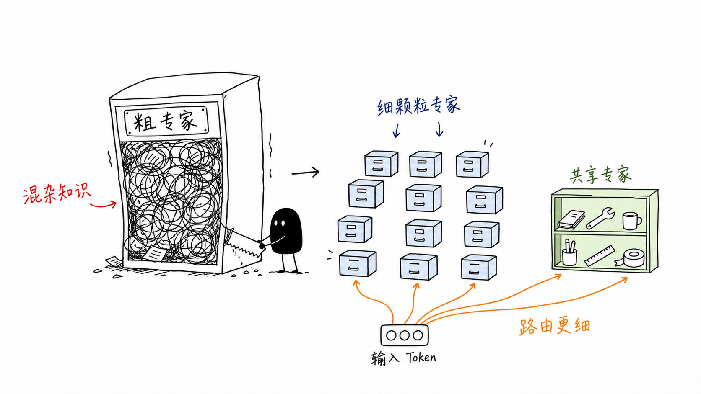
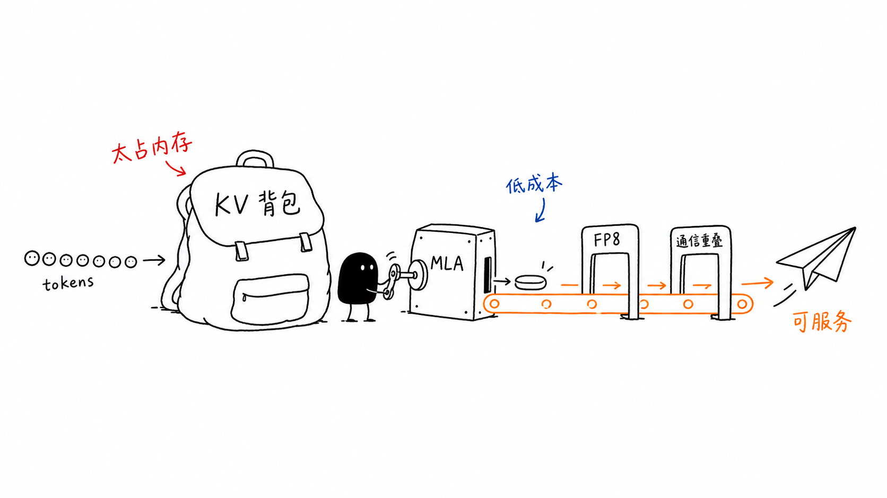
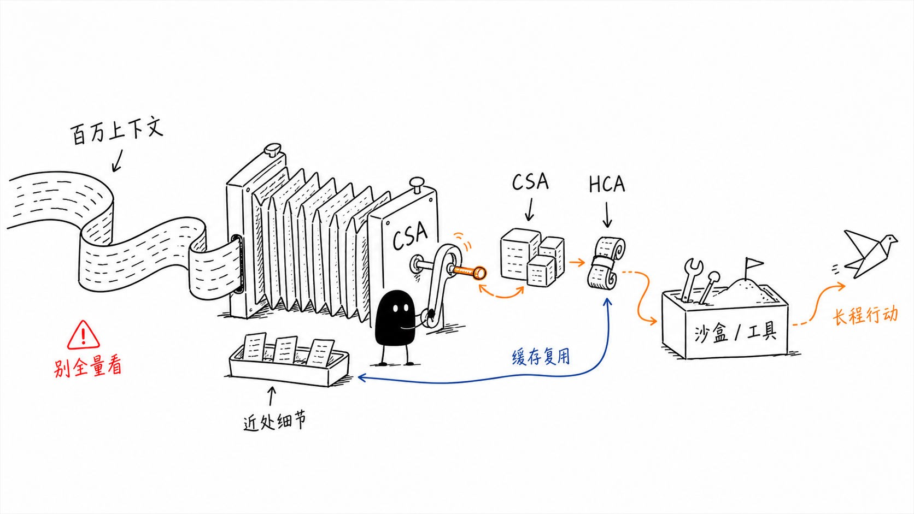

# The Efficiency Moat: How DeepSeek Rewrote the AI Scaling Playbook

For the better part of the last decade, the artificial intelligence industry has been governed by a single, expensive dogma: more compute equals better models. Frontier labs poured billions of dollars into massive GPU clusters, consuming power at the scale of small cities to squeeze incremental gains out of dense neural architectures. The prevailing assumption was that the path to AGI was paved with brute-force scaling, creating a capital-intensive barrier to entry.

DeepSeek's roadmap represents a calculated divergence from this brute-force consensus. While much of the industry was building bigger hammers, DeepSeek was reimagining the physics of the nail. By prioritizing architectural efficiency and full-stack co-design over raw resource consumption, it has challenged the "more is more" narrative. Its trajectory is not just a technical curiosity; it is a shift toward "intelligence through optimization" that tests the economic sustainability of larger competitors.

How did one lab challenge the scaling laws of the giants? Not with a single breakthrough, but with a sequence of innovations that optimized every layer of the stack, from how experts are organized to how models are trained and served. By weaponizing efficiency, DeepSeek built a moat based on unit economics rather than raw cluster size.

Here is the technical roadmap behind that rise: a sequence of bottlenecks, compression moves, and full-stack design choices that turned efficiency into strategy.

## DeepSeek's Roadmap as a Sequence of Scaling Bottlenecks

DeepSeek's technical roadmap is easiest to read as a sequence of bottleneck removals. Each paper targets a different constraint that appears when models are pushed toward higher capability under lower cost: dense parameter activation, weak domain structure, KV-cache growth, MoE training instability, reasoning trajectory cost, and finally million-token memory.

The progression is not "make every model larger." It is: make capacity sparse, make data domain-shaped, compress attention memory, stabilize frontier MoE training, induce reasoning with verifiable RL, and then redesign long-context memory so reasoning does not drown in its own context.

That framing matters because it keeps the article technical. Each section below asks the same three questions: what constraint was binding, what mechanism removed part of it, and what new constraint remained.

## A Compression Perspective on DeepSeek's Roadmap

DeepSeek's roadmap can also be understood as a sequence of attempts to increase effective model capability while controlling the cost of three growing axes: parameter/latent capacity, sequence/context length, and reasoning trajectory length.

The SVD intuition is useful here. A Transformer layer is largely a stack of learned linear maps plus nonlinear routing, gating, normalization, and attention. For a linear map, viewing the weight matrix as $W = U \Sigma V^\top$ is a good conceptual model: the input is correlated with learned directions, singular values amplify or suppress those directions, and the output is reconstructed in another learned feature basis. Increasing model width or FFN dimension increases the number and richness of these directions. That is capacity scaling. If every token uses all directions all the time, cost grows directly with capacity.

This is where DeepSeekMoE fits. Instead of making every token activate the entire parameter basis, it routes each token to a subset of experts. Fine-grained expert segmentation increases routing resolution, while shared experts provide a common path for frequently used features. This is not a hard decomposition of feature space. It does not guarantee that common-feature gradients only go to shared experts. It is better understood as a soft architectural prior: make common structure easy to learn in shared experts, and reserve routed experts for residual specialization.

DeepSeek-Coder and DeepSeekMath are not mainly about compression; they are about making the learned feature space useful for specific domains. In this language, they change what the singular directions are trained to represent. Repository-level code pretraining teaches software-structural features: functions, APIs, imports, tests, and cross-file conventions. Math continuation training and GRPO teach symbolic and reasoning-oriented directions. Capacity is not abstract; the representation basis becomes useful only when the data distribution and objective expose the right structure.

DeepSeek-V2 introduces the second axis: the sequence/context dimension. MLA does not primarily compress the number of tokens. It compresses the per-token cached KV representation along the latent/channel dimension. Standard attention stores a large K/V representation for every token and every layer. MLA says: much of the multi-head K/V information is redundant because the per-head K/V vectors are all projected from the same hidden state. So instead of caching full expanded K/V states, cache a smaller latent KV state. MoE sparsifies the parameter/feature transformation; MLA compresses the per-token memory representation of attention. These are orthogonal. MoE reduces activated FFN compute; MLA reduces KV-cache width. Both are needed because LLM cost is not one-dimensional.

DeepSeek-V3 then asks whether this efficient architecture can scale to a frontier general model. It keeps MLA and DeepSeekMoE, but adds auxiliary-loss-free load balancing, Multi-Token Prediction, and large-scale FP8/system engineering. At this stage, DeepSeek is not inventing one new mathematical trick; it is proving that latent/parameter-axis and KV-cache-axis optimizations can survive frontier-scale training.

DeepSeek-R1 adds the third axis: reasoning trajectory length. After V3, the question is no longer only "how much knowledge can the model store?" or "how cheaply can it serve long context?" The question becomes: can the model spend more test-time computation productively? GRPO turns verifiable outcomes into a reinforcement signal without a critic. In this framework, R1 is not primarily compressing latent dimension or sequence dimension. It is optimizing the trajectory dimension: longer reasoning traces, more self-checking, and more deliberate problem solving. But this immediately creates a new systems bottleneck: long reasoning traces and agentic workflows create long contexts, high KV-cache pressure, and expensive rollouts.

That is why DeepSeek-V4 is the natural next step. MLA compresses the per-token KV width, but still stores one cached state per token, so the cache grows linearly with sequence length. V4 moves from latent-dimension KV compression to sequence-dimension compression through CSA/HCA. CSA compresses blocks of tokens and sparsely selects relevant compressed blocks; HCA compresses more aggressively and attends densely over the heavily compressed sequence. V4 also adds heterogeneous KV-cache management, on-disk KV storage, mHC, Muon, FP4 QAT, OPD, rollout infrastructure, and sandbox infrastructure.

The refined roadmap is:

- DeepSeekMoE: control parameter/latent capacity by sparse expert activation.
- DeepSeek-Coder / DeepSeekMath: shape the learned feature basis through domain-specific data and objectives.
- DeepSeek-V2: compress per-token KV memory through MLA while keeping sparse capacity through MoE.
- DeepSeek-V3: scale this economical architecture into a frontier general model with load balancing, MTP, and FP8/system optimization.
- DeepSeek-R1: scale reasoning trajectories through GRPO-based RL.
- DeepSeek-V4: control the sequence/context explosion caused by long reasoning and agentic workflows through CSA/HCA and full-stack cache/system co-design.

The compression-view thesis is simple: DeepSeek's roadmap is a case study in capability scaling under resource constraints. As model capability grows, the bottleneck moves from parameter capacity, to domain representation, to KV-cache memory, to reasoning trajectory cost, and finally to million-token context systems. Each DeepSeek generation targets the dominant bottleneck exposed by the previous one.

The roadmap below is organized by first public paper/release date, then by the main technical innovation introduced or consolidated in each work. For arXiv papers, the ordering uses first submission date; revision dates are noted only when they affect the local PDF. The DeepSeek-V4 entry uses the Hugging Face model card and technical report rather than an arXiv record.

## Chronological Roadmap

| Date | Paper | Main innovation | Problem solved | Later impact |
|---|---|---|---|---|
| 2024-01-11 | DeepSeekMoE | Fine-grained expert segmentation and shared expert isolation | Conventional MoE has weak expert specialization, knowledge hybridity, and redundant common knowledge across experts | Foundation for DeepSeek-V2, V3, Coder-V2, R1 base, and V4 |
| 2024-01-25 | DeepSeek-Coder | Repository-level code pre-training, dependency-aware file ordering, FIM, 16K context | Open code models were mostly file-level and weak at project-scale generation and infilling | Becomes the code-specialist lineage and a base for DeepSeekMath |
| 2024-02-05 | DeepSeekMath | Math corpus construction and GRPO | Open models lagged closed models on math; PPO-style RL was costly because it required a value/critic model | GRPO becomes DeepSeek's core RL algorithm across math, V2, Coder-V2, R1, V3, and V4 |
| 2024-05-07 | DeepSeek-V2 | MLA plus DeepSeekMoE at scale | Large models were costly to train and expensive to serve because dense compute and KV cache grow quickly | Establishes efficient general-purpose MoE backbone with 128K context |
| 2024-06-17 | DeepSeek-Coder-V2 | Continued pre-training of V2 on code/math/NL, 338 languages, 128K context, code RL | Open code models still trailed GPT-4 Turbo/Claude/Gemini-level code intelligence | Shows the V2 backbone can be domain-specialized without losing general ability |
| 2024-12-27 | DeepSeek-V3 | Auxiliary-loss-free load balancing, MTP, FP8 training, DualPipe | Scaling MoE to frontier performance needed better load balance, faster training, and lower memory cost | Becomes the high-performance base for R1 and validates low-cost frontier-scale training |
| 2025-01-22 | DeepSeek-R1 | Large-scale reasoning RL without initial SFT, then multi-stage alignment and distillation | Human-written CoT and SFT can constrain reasoning exploration; reasoning models need scalable RL | Turns GRPO into a reasoning capability engine and distills reasoning into smaller models |
| 2026 | DeepSeek-V4 | CSA/HCA hybrid attention, mHC, Muon, FP4 experts, fine-grained MoE inference kernels | Test-time scaling and agentic work need efficient million-token context | Extends DeepSeek from efficient MoE to efficient ultra-long-context reasoning and agents |

## Innovation 1: DeepSeekMoE - Making Sparse Capacity More Effective

### 1. Problem to Solve

Dense scaling is expensive because every token activates the full model. If model capacity is increased by making a dense Transformer larger, both training and inference cost rise directly with the number of active parameters. MoE provides a natural way to decouple total parameters from activated parameters: the model can contain many experts, but each token only activates a small subset.

However, conventional top-$K$ MoE has an important weakness: sparse activation does not automatically imply clean specialization. If each routed expert is large and coarse-grained, a single expert may still have to represent many unrelated forms of knowledge. Such experts become hybrid "mini dense models" rather than clean specialists. At the same time, common knowledge - basic syntax, frequent token patterns, common semantic structures, and general language modeling ability - may be redundantly learned across many routed experts. This weakens the effective value of sparse capacity.

### 2. Key Technical Idea

DeepSeekMoE improves MoE not by simply adding more experts, but by changing the structure of expert specialization. It introduces two coupled ideas: fine-grained expert segmentation and shared expert isolation.

Fine-grained expert segmentation increases the resolution of routing. Instead of selecting a few large experts, the model creates many smaller experts and lets the router assemble a more precise combination of them for each token. The conceptual shift is from "choose a small number of broad experts" to "compose a token-specific mixture of finer sub-skills."

Shared expert isolation introduces always-active shared experts for common knowledge. The conceptual shift is to separate common capacity from routed capacity. Common experts provide a stable path for knowledge that almost every token needs, while routed experts are relatively encouraged to focus on residual, specialized, or long-tail patterns.

### 3. Detailed Technical Implementation

In a conventional MoE layer, assume the model has $N$ routed experts and activates $K$ experts for each token. Each expert is usually a full-size FFN, so the router chooses among a small number of broad transformations. DeepSeekMoE changes this by splitting the FFN intermediate dimension. If each conventional expert is segmented into $m$ smaller experts, the pool grows from $N$ experts to $mN$ experts, while each expert has roughly $1/m$ of the original intermediate width. The router then activates $mK$ smaller experts so that activated expert width and per-token FFN compute remain roughly comparable to the original top-$K$ design.

The forward pass is therefore a sum of three pieces: the residual/token input, the outputs of shared experts, and the gated outputs of selected routed experts. For routed experts, the router computes token-to-expert affinity scores, keeps only the top-$K_r$ routed experts, normalizes the selected gate values, and multiplies each selected expert output by its gate. The important implementation detail is that "more experts" does not mean "more active compute" in the same proportion. The paper's 2B validation model, for example, uses one shared expert and 63 routed experts, with seven routed experts activated per token; each expert is 0.25 times the size of a standard FFN.

In simplified notation, the MoE output can be read as:

$$
h'_t =
u_t
+
\sum_{i=1}^{N_s} \operatorname{FFN}^{(s)}_i(u_t)
+
\sum_{i=1}^{N_r} g_{i,t}\operatorname{FFN}^{(r)}_i(u_t),
$$

where $N_s$ shared experts are always active, $N_r$ routed experts are candidates, and $g_{i,t}$ is nonzero only for the top-$K_r$ routed experts selected for token $t$. This equation is the practical distinction between shared and routed capacity: shared experts contribute a dense common path; routed experts contribute sparse token-specific capacity.

Shared expert isolation is implemented by taking some experts out of the router entirely. These shared experts are deterministically active for every token. To preserve total compute, the number of activated routed experts is reduced when shared experts are added. The complete DeepSeekMoE layer is thus not simply top-$K$ over all experts; it is "always use the shared experts, then route over the routed experts." In the 16B scaled model, each MoE layer uses two shared experts and 64 routed experts, routes each token to six routed experts, and keeps each expert at 0.25 times the standard FFN size. In the preliminary 145B setting, the paper reports four shared experts and 128 routed experts, with twelve routed experts activated and each expert 0.125 times the standard FFN size.

The paper also adds load-balancing machinery because fine-grained routing increases the risk of expert collapse. It uses an expert-level balance loss to prevent a few routed experts from receiving most tokens. When experts are spread across devices, it also uses a device-level balance loss so expert parallelism does not create severe hardware imbalance. For the 16B model, the expert-level balance factor is made very small because stronger balancing degraded performance under their parallelization strategy.

Training and validation are staged. The paper first tests 2B-scale models with all FFNs replaced by MoE layers, then compares DeepSeekMoE against Hash Layer, Switch Transformer, GShard, larger GShard variants, and dense upper-bound baselines. It then trains DeepSeekMoE 16B on 2T tokens and performs SFT to produce a chat model. The ablations are part of the implementation story: they separately test shared expert isolation, finer segmentation into 32 or 64 experts, different shared/routed ratios, disabling top routed experts, and reducing activated experts. Those experiments are what support the architectural claim that DeepSeekMoE improves specialization rather than merely increasing parameter count.

### 4. Why the Technology Can Work

Fine-grained expert segmentation can work because many token-level computations are compositional. A token rarely needs one large, monolithic skill. It may simultaneously require syntax, local semantics, factual recall, code structure, mathematical pattern recognition, multilingual knowledge, or domain-specific terminology. Large coarse experts force these skills to be bundled together. Smaller experts let the router assemble a more precise combination of sub-capabilities.

The result is higher effective MoE expressivity. Even if the total activated compute is similar, the number of possible expert combinations increases significantly. The model has more ways to represent different token types, domains, and contexts. The benefit is not merely more parameters; it is more routing resolution.

Shared expert isolation can work because common features are statistically frequent. Shared experts are active for all tokens, so they receive dense and consistent gradients from the whole training distribution. Routed experts only receive gradients from the subset of tokens routed to them. Since common language patterns occur everywhere, the shared experts are naturally positioned to learn them more reliably.

Once shared experts learn part of the common structure, routed experts can be used more efficiently. They are no longer under the same pressure to independently relearn every basic linguistic or semantic pattern. Instead, their most useful contribution is to explain what the shared path does not already explain well: domain-specific, rare, token-dependent, or context-dependent residual patterns.

### 5. Why the Technology Has Limitations

DeepSeekMoE does not provide hard knowledge disentanglement. That is the key caveat. If a routed expert is active for a token, it receives gradients from the full token-level loss. The loss is not decomposed into "common-feature loss" and "specialized-feature loss." Common-feature gradients can still update routed experts, and routed experts can still learn common knowledge.

Shared experts only create an architectural prior. They do not force common knowledge to stay out of routed experts. If the router repeatedly sends generic tokens to certain routed experts, those experts may still become generic. If duplicated common features reduce loss, optimization may still preserve redundancy.

Fine-grained experts also introduce systems and optimization challenges. More experts mean more routing decisions, more dispatch complexity, and potentially more load-balancing difficulty. If routing collapses, some experts may be overused while others remain undertrained. If experts are too fine-grained, individual experts may lack enough capacity or enough data to learn robust functions. Fine-grained segmentation improves routing resolution, but it also makes routing quality more important.

**Core limitation.** DeepSeekMoE improves the usefulness of sparse capacity, but it does not guarantee clean expert disentanglement, perfect load balance, or zero redundancy between shared and routed experts.

### 6. Transition to the Next Bottleneck

DeepSeekMoE makes sparse capacity more useful, but it is still domain-agnostic. The next bottleneck is not how to route generic tokens through experts; it is how to make the training distribution expose the structure of a difficult domain. That is where DeepSeek-Coder shifts the roadmap from architecture-only efficiency to data/objective design.

## Innovation 2: DeepSeek-Coder - Repository-Level Code Intelligence

### 1. Problem to Solve

DeepSeek-Coder addresses the first major domain-specialization bottleneck in DeepSeek's roadmap: a general language model does not automatically become a strong code model just by scaling parameters. Code is structurally different from natural language. It has strict syntax, executable semantics, long-range dependencies, APIs, tests, build systems, file-level organization, and repository-level conventions. A model trained mostly on ordinary text or isolated code snippets may learn local syntax and common programming idioms, but it will struggle with cross-file dependencies, code infilling, repository-level context, and realistic software editing.

The core problem is not simply "generate code." It is: how can an open model learn code as a software-system object rather than as disconnected token sequences? DeepSeek-Coder's answer is to move the training unit closer to real software repositories and to align the objective with how programmers actually edit code. The paper introduces models from 1.3B to 33B parameters, trained from scratch on 2T tokens, using a high-quality project-level code corpus, fill-in-the-blank/FIM-style training, and a 16K context window.

### 2. Key Technical Idea

The key idea is that code intelligence is a data-and-context problem before it is an agent problem. DeepSeek-Coder does not merely fine-tune a general model on code instructions. It builds code capability into the base model through large-scale project-level pretraining. Repository-level data exposes the model to the natural structure of software: definitions, imports, dependencies, tests, comments, file layouts, and repeated naming conventions.

The second idea is to make the learning objective closer to real code editing. Programmers rarely only append text left-to-right. They often insert, replace, or complete code inside an existing file. DeepSeek-Coder uses fill-in-the-middle/fill-in-the-blank style training so the model can generate a missing code span conditioned on both prefix and suffix. This is crucial for IDE completion, patching, and local refactoring.

The third idea is to extend context. Code often has stronger long-range dependency than natural language. A symbol, function signature, import, or test hundreds or thousands of tokens away can determine the correct completion. A 16K context window makes repository-level training more useful because the model can observe larger software units during pretraining.

### 3. Detailed Technical Implementation

DeepSeek-Coder is trained from scratch on 2T tokens rather than adapted from a general chat model. The corpus mixture is code-heavy: 87% source code, 10% English code-related natural language from sources such as GitHub Markdown and StackExchange, and 3% code-unrelated Chinese natural language. The source-code side covers 87 programming languages. After cleaning, the paper reports about 798GB of source code across roughly 603 million files.

The data pipeline is a major part of the implementation. DeepSeek collects public GitHub repositories created before February 2023, then applies rule-based filters similar to StarCoder: remove files with average line length above 100 characters, maximum line length above 1000 characters, fewer than 25% alphabetic characters, XML-like boilerplate in most languages, weak visible-text ratio for HTML, and data-heavy JSON/YAML outside a 50 to 5000 character range. These filters reduce the initial data to 32.8% of its original size before later screening.

Repository-level construction is implemented with dependency parsing. For each project, the pipeline extracts cross-file invocation patterns using language-specific regular expressions such as `import` in Python, `using` in C#, and `include` in C. It builds a file dependency graph, decomposes disconnected subgraphs, and applies a modified topological sort that chooses minimum in-degree files so it can still proceed when cycles exist. The sorted files are concatenated into repository-level training samples, and a file-path comment is inserted at the beginning of each file so the model sees location information. This is much more concrete than "train on repositories": the sequence order is deliberately arranged so dependencies tend to appear before dependent files.

Deduplication is also repository-aware. Instead of deduplicating individual files, the paper treats concatenated repository-level code as one sample and applies near-deduplication at that level, avoiding the failure mode where file-level deduplication removes individual files and damages repository structure. A later quality-screening stage combines compiler checks, a quality model, and heuristics to remove code with syntax errors, poor readability, or weak modularity.

The training objective combines ordinary next-token prediction with Fill-in-the-Middle. FIM randomly splits text into prefix, middle, and suffix, then trains the model to reconstruct the middle from surrounding context. The paper studies PSM and SPM variants and ablates FIM rates. It finds that 100% FIM gives the best HumanEval-FIM score but hurts normal completion, making 50% FIM the practical tradeoff. The final model family uses a 16K context window so repository-level packing and code infilling can actually expose long cross-file context during pretraining. The released series spans 1.3B, 5.7B, 6.7B, and 33B base/instruct variants, with instruction tuning applied after base pretraining.

The important practical detail is that FIM is not an evaluation-only feature. It changes pretraining examples before packing: a code document is cut into prefix, middle, and suffix spans, control tokens mark the hole, and the target sequence places the missing middle after the surrounding context. This makes infilling a native base-model behavior rather than a behavior learned only during instruction tuning.

### 4. Why the Technology Can Work

DeepSeek-Coder works because it reduces the mismatch between the training distribution and the real structure of programming. If a model is trained on repository-level data, it repeatedly observes software as a connected system rather than as isolated local syntax. Over many examples, it can learn regularities such as import-use relations, class-method organization, test-driven behavior, library conventions, and API usage patterns.

FIM works because code editing is naturally bidirectional. A missing implementation is constrained not only by what comes before it, but also by what comes after it. For example, the suffix may reveal the expected return type, error handling, variable names, or downstream usage. By training the model to fill missing spans using both sides, DeepSeek-Coder teaches it an editing behavior that matches how code is actually written.

Long context works because code has high long-range mutual information. In natural language, distant context may be useful but often optional. In code, distant context may be decisive. One import alias, type definition, or test assertion can determine what the model should generate. A longer context window directly improves the model's ability to use software structure.

So DeepSeek-Coder's success comes from aligning data unit, objective, and context length with the structure of code. This is the real contribution. It is not just "more code data"; it is a more code-native pretraining formulation.

### 5. Why the Technology Has Limitations

DeepSeek-Coder's main limitation is that it remains primarily a static code model, not an executable software-engineering agent. It learns from repository-level code data, but it does not natively learn through the loop that defines real programming: edit code, run tests, observe failures, inspect errors, revise the patch, and repeat. This gap becomes clearer in later executable coding benchmarks and repository-agent work, which evaluate models in environments where code must be inspected, modified, run, and repaired rather than merely predicted.

Long context is also not the same as long-horizon software engineering. Real tasks require repository exploration, multi-file planning, test execution, failure diagnosis, and iterative patch refinement. [SWE-QA-Pro](https://arxiv.org/abs/2603.16124) reports strong gains from agentic workflows on long-tail repositories, while [FeatureBench](https://arxiv.org/abs/2602.10975) shows that feature-oriented development remains difficult even for strong agentic systems. These results make the same point from different angles: repository-level pretraining helps a model understand software structure, but it does not by itself create a full development loop.

Other later benchmarks sharpen the remaining gaps. [C3-Bench](https://arxiv.org/abs/2601.15879) highlights instruction-controlled completion, [RepoZero](https://arxiv.org/abs/2605.07122) tests full repository reproduction, and [SWE-Bench Mobile](https://arxiv.org/abs/2602.09540) brings in industrial mobile-development constraints such as PRDs, Figma designs, Swift/Objective-C codebases, and platform tests. Together they show that code intelligence eventually has to become tool-grounded, instruction-following, multimodal, and execution-aware.

**Core limitation.** DeepSeek-Coder addressed code representation learning, but not software-engineering agency. It improved the model's ability to model code repositories, but it did not fully solve executable feedback, long-horizon planning, multi-file intervention, instruction-controlled editing, repository synthesis, multimodal product grounding, or agent/tool orchestration.

### 6. Transition to the Next Bottleneck

DeepSeek-Coder shows that data layout and training objective can create domain capability, but its code competence remains mostly predictive: complete, infill, and generate. DeepSeekMath takes the same pattern into a domain where final answers can often be verified, making it possible to add reinforcement learning on top of domain pretraining.

## Innovation 3: DeepSeekMath - From Code Intelligence to Mathematical Reasoning

### 1. Problem to Solve

DeepSeekMath addresses a different bottleneck from DeepSeek-Coder. Code pretraining gives the model syntax, procedural structure, and algorithmic patterns, but mathematical reasoning requires something more specific: the ability to maintain symbolic constraints over many steps, transform expressions correctly, choose useful intermediate lemmas, and arrive at an answer through a valid chain of reasoning. The problem is not simply that the model lacks mathematical facts; the deeper issue is that ordinary next-token prediction does not strongly enforce reasoning correctness.

Before DeepSeekMath, many open models could imitate solution styles but still failed on competition-level mathematics. Their generated reasoning might look plausible, but small local mistakes could invalidate the final answer. DeepSeekMath targets a precise capability-scaling roadblock: how can an open 7B-scale model acquire strong mathematical reasoning without relying on huge closed-model scale, external symbolic tools, or expensive human-labeled reasoning traces? DeepSeekMath's answer is to combine math-focused continued pretraining with reinforcement learning, specifically GRPO. The paper continues pretraining DeepSeek-Coder-Base-v1.5 7B on 120B math-related tokens from Common Crawl, mixed with natural language and code data, and reports 51.7% on MATH without external toolkits or voting, and 60.9% with 64-sample self-consistency.

### 2. Key Technical Idea

The key idea is that mathematical reasoning can be improved by aligning data, base capability, and RL objective.

The first component is math-specific data construction. DeepSeekMath does not rely only on existing curated math datasets, which are too small to support broad pretraining. Instead, it mines math-related data from web-scale Common Crawl, using a carefully engineered data-selection pipeline. The model needs exposure not only to final answers, but also to mathematical language, derivations, symbolic notation, proof-like explanations, and problem-solving patterns.

The second component is starting from a code-capable base model. DeepSeekMath continues from DeepSeek-Coder-Base-v1.5 7B rather than from a generic natural-language model. This is a reasonable design choice because code pretraining already gives the model procedural and symbolic regularities: functions, variables, control flow, exact syntax, and algorithmic decomposition. These are not identical to mathematics, but they provide a better substrate for mathematical reasoning than generic text alone.

The third component is GRPO, a lightweight reinforcement-learning method. Instead of using standard PPO with a separate critic/value model, GRPO estimates relative advantage within a group of sampled responses. This reduces the memory overhead of PPO while still pushing the model toward answer correctness. The strategic move is clear: use outcome-verifiable math problems to turn reasoning improvement into a scalable RL problem.

### 3. Detailed Technical Implementation

DeepSeekMath starts with data construction, not RL. The paper builds the DeepSeekMath Corpus from Common Crawl using an iterative fastText pipeline. It begins with OpenWebMath as a high-quality seed corpus, samples 500,000 positive examples from it and 500,000 negative examples from Common Crawl, and trains a fastText classifier with vector dimension 256, learning rate 0.1, word n-gram length up to 3, minimum word count 3, and 3 epochs. Common Crawl is first URL-deduplicated and near-deduplicated to about 40B HTML pages, then scored by the classifier.

The data-mining loop is repeated rather than done once. After the first pass, DeepSeek organizes Common Crawl into domains, finds domains where more than 10% of pages were collected as math-related, manually annotates math URL paths within those domains, and adds those pages back into the positive seed pool. After four iterations, the pipeline produces 35.5M mathematical web pages and 120B tokens. The corpus is multilingual, mainly English and Chinese, and benchmark contamination is filtered by removing web pages containing exact 10-gram matches from evaluation benchmarks, with exact matching for shorter benchmark strings of 3 to 9 grams.

The model training has two distinct scales. First, the paper validates the corpus using 1.3B models trained for 150B tokens on different math corpora. These experiments use AdamW with $\beta_1=0.9$, $\beta_2=0.95$, weight decay 0.1, a multi-step learning-rate schedule with 2000 warmup steps, peak learning rate $5.3 \times 10^{-4}$, batch size 4M tokens, and 4K context. The main DeepSeekMath-Base 7B is then initialized from DeepSeek-Coder-Base-v1.5 7B and trained for 500B tokens, with a mixture of 56% DeepSeekMath Corpus, 4% AlgebraicStack, 10% arXiv, 20% GitHub code, and 10% English/Chinese natural-language Common Crawl. For the 7B run, the peak learning rate is $4.2 \times 10^{-4}$ and the batch size is 10M tokens.

After continued pretraining, DeepSeekMath applies mathematical instruction tuning. The instruction stage mixes chain-of-thought, program-of-thought, and tool-integrated reasoning data so the model learns multiple answer styles: self-contained natural-language solutions, Python-aided solutions, and tool-integrated solutions. This is why the paper evaluates both no-tool math solving and Python-assisted math solving.

The RL stage introduces GRPO. For each prompt, GRPO samples a group of outputs, scores them, and normalizes each output's reward relative to the group mean and standard deviation to estimate advantage. This removes the separate critic/value model used in PPO. DeepSeekMath uses only a subset of English instruction-tuning data for RL, but still reports gains from DeepSeekMath-Instruct to DeepSeekMath-RL. The paper also compares GRPO with related methods such as RFT, DPO, and PPO, and studies online versus offline sampling, outcome versus process supervision, and iterative RL. So the implementation is not merely "apply RL"; it is a data-mining pipeline, continued pretraining recipe, instruction-tuning stage, and critic-free group-relative RL recipe.

The GRPO advantage estimate is the core memory-saving move:

$$
A_i =
\frac{r_i - \operatorname{mean}(r_1,\ldots,r_G)}
{\operatorname{std}(r_1,\ldots,r_G)}.
$$

PPO needs a learned value model to estimate advantage; GRPO uses the reward distribution inside the sampled group. That is why the method is attractive for 7B-scale math RL and later for larger DeepSeek reasoning models.

### 4. Why the Technology Can Work

DeepSeekMath can work because mathematics has a useful property: many problems are outcome-verifiable. Unlike open-ended writing, math problems often have clear final answers. This makes reinforcement learning more practical. The model can sample multiple reasoning paths, and correct outcomes provide a signal for which paths should be reinforced.

The approach also works because code pretraining and math reasoning share structural features. Both require variables, symbolic manipulation, long-range consistency, and procedural decomposition. A code-trained base model is already better prepared to represent stepwise transformations than a purely natural-language model. Continued math pretraining then shifts this procedural substrate toward mathematical notation and problem-solving patterns.

GRPO works as a pragmatic compromise. It is not a full process verifier, but it makes RL more scalable by avoiding a separate critic model. For a 7B model, this is important: the method improves reasoning without requiring the full cost structure of large PPO-based RL. In this sense, DeepSeekMath is not only a math model; it is an experiment in low-cost reasoning amplification.

The self-consistency result also reveals why the model has learned useful reasoning distributions rather than only a single deterministic mapping. When the model samples many solutions and votes or selects among them, performance improves substantially, suggesting that correct reasoning paths exist in the model's distribution even when a single sample may fail. DeepSeekMath reports 60.9% on MATH with 64-sample self-consistency, compared with 51.7% without external toolkits or voting.

### 5. Why the Technology Has Limitations

DeepSeekMath's main limitation is that it optimizes mathematical reasoning largely through final-answer correctness, not through rigorous proof verification. A correct final answer does not guarantee a correct derivation. The reasoning trace may contain lucky guesses, invalid steps, hidden cancellations, or inconsistent arguments. This limitation became explicit in later work: [DeepSeekMath-V2](https://arxiv.org/abs/2511.22570) argues that final-answer RL can drive strong benchmark gains while still failing to guarantee step-by-step correctness.

The reward signal is only as good as the verifier. Many math problems are easy to check if the answer is a number or expression, but hard to check if the task asks for a proof, construction, or explanation. For proof-oriented mathematics, final-answer reward becomes insufficient. [DeepSeek-Prover-V2](https://arxiv.org/abs/2504.21801) later moves toward Lean-based formal theorem proving and subgoal decomposition, showing that mathematical reasoning eventually requires formal verification, not only natural-language answer matching.

DeepSeekMath also lacks explicit process supervision and long-horizon proof search. [Qwen2.5-Math](https://arxiv.org/abs/2409.12122) moves toward iterative verifier/model co-evolution; [Kimi k1.5](https://arxiv.org/abs/2501.12599) frames long-context RL as a new scaling axis; and Google DeepMind's [AlphaProof and AlphaGeometry 2](https://deepmind.google/discover/blog/ai-solves-imo-problems-at-silver-medal-level/) show the value of combining language models with formal or symbolic systems. DeepSeekMath is broadly useful as an informal mathematical reasoner, but it is not a proof system or an autonomous mathematical discovery engine.

**Core limitation.** DeepSeekMath made mathematical reasoning a scalable data-plus-RL problem, but it did not solve faithful proof reasoning, process verification, formal correctness, long-horizon proof search, or autonomous mathematical discovery.

### 6. Transition to the Next Bottleneck

DeepSeekMath adds a cheap RL mechanism for verifiable reasoning, but it is still a 7B domain model. The next bottleneck is architectural: how to combine sparse capacity and cheap long-context serving in a general-purpose model large enough to support code, math, and broad instruction following. DeepSeek-V2 is that merge point.

## Innovation 4: DeepSeek-V2 - Combining Sparse Capacity with Cheap Long-Context Inference

### 1. Problem to Solve

DeepSeek-V2 addresses the next bottleneck after DeepSeekMoE, DeepSeek-Coder, and DeepSeekMath: how to make a strong general-purpose model economical at both training time and inference time.

DeepSeekMoE had already shown how to increase total parameter capacity without activating all parameters for every token. But sparse capacity alone does not solve the inference-cost problem. In autoregressive decoding, a large part of the cost comes from the attention KV cache. Even if each token activates only a subset of MoE experts, the model still needs to store and read historical key/value states for long-context generation. As the context grows, KV cache becomes a memory-capacity and memory-bandwidth bottleneck.

Here the roadmap turns: capacity scaling is not only limited by FLOPs; it is also limited by memory movement and KV-cache storage. DeepSeek-V2 targets two costs at once: sparse computation through DeepSeekMoE, and cheap long-context inference through Multi-head Latent Attention. The paper presents DeepSeek-V2 as a 236B-parameter MoE model with only 21B activated parameters per token, supporting 128K context, and reports 42.5% lower training cost, 93.3% KV-cache reduction, and up to 5.76x higher maximum generation throughput compared with DeepSeek 67B.

### 2. Key Technical Idea

The key idea of DeepSeek-V2 is to combine sparse capacity with compressed attention state.

DeepSeekMoE solves the activated-parameter problem: the model can have a large total parameter count, but each token only uses a small subset of experts. Multi-head Latent Attention solves the KV-cache problem: instead of storing large key/value tensors for every attention head, the model compresses the KV state into a latent representation. Together, these two mechanisms make DeepSeek-V2 economical in a way that neither one alone could achieve.

Conceptually, DeepSeek-V2 is the point where DeepSeek moves from "make the model bigger but sparse" to "make the model bigger, sparse, and serveable." That makes V2 a decisive architecture-level milestone. It is not just a better model; it is a model designed around serving economics.

### 3. Detailed Technical Implementation

DeepSeek-V2 is a Transformer whose attention and FFN modules are both redesigned. The released full model has 236B total parameters with 21B activated per token; the smaller V2-Lite has 15.7B total parameters with 2.4B activated per token. In the FFN blocks, V2 adopts DeepSeekMoE: shared experts are always active, routed experts are selected by top-$K$ routing, and expert parallelism is used during training. Because MoE routing creates communication pressure, V2 adds device-limited routing so a token's selected routed experts are constrained to a limited number of devices. It also uses auxiliary losses for expert-level and device-level load balance, plus a token-dropping strategy when imbalance would otherwise exceed capacity.

The distinctive attention implementation is Multi-head Latent Attention. In standard MHA, generation caches all keys and values for every previous token and every layer, requiring $2n_hd_hl$ cached elements per token, where $n_h$ is number of heads, $d_h$ is per-head dimension, and $l$ is number of layers. MLA instead computes a compressed latent KV vector:

$$c^{KV}_t = W^{DKV} h_t$$

and reconstructs compressed keys and values through up-projections:

$$k^C_t = W^{UK} c^{KV}_t,\quad v^C_t = W^{UV} c^{KV}_t.$$

During inference, the model caches $c^{KV}_t$ rather than full per-head keys and values. The paper notes that $W^{UK}$ can be absorbed into the query projection and $W^{UV}$ into the output projection during inference, so the model does not need to explicitly materialize full keys and values for every cached prefix token.

MLA also adds low-rank query compression to reduce activation memory during training:

$$c^Q_t = W^{DQ}h_t,\quad q^C_t = W^{UQ}c^Q_t.$$

A subtle implementation issue is RoPE. If RoPE is applied directly to compressed keys, the position-sensitive rotation prevents the key up-projection from being absorbed into the query side during inference. V2 solves this with decoupled RoPE: content keys/queries use the compressed path, while separate RoPE-carrying query/key components are produced and concatenated with the compressed components. As a result, V2 caches both the latent KV vector and the decoupled RoPE key, giving a cache size proportional to $(d_c + d^R_h)l$ instead of full MHA's $2n_hd_hl$.

The pretraining and alignment recipe is also explicit. V2 is pretrained on an 8.1T-token multi-source corpus, then extended to 128K context, then aligned with 1.5M conversational sessions covering math, code, writing, reasoning, safety, and other domains. Supervised fine-tuning produces a chat model, and GRPO-style reinforcement learning further aligns it with human preferences. The headline efficiency results - 42.5% lower training cost, 93.3% KV-cache reduction, and 5.76x maximum generation throughput versus DeepSeek 67B - come from this combined MoE plus MLA implementation, not from MoE alone.

### 4. Why the Technology Can Work

DeepSeek-V2 can work because it attacks two different scaling bottlenecks that multiply each other.

The first bottleneck is active compute. Dense models spend computation on all parameters for all tokens. DeepSeekMoE reduces this by making the FFN computation conditional: only selected experts are activated for each token. This gives the model high total capacity without proportional per-token FLOPs.

The second bottleneck is attention memory. In long-context decoding, the model repeatedly reads historical KV states. Even if the FFN is sparse, attention can still be memory-bound. MLA reduces the size of this historical state by compressing the KV cache into latent vectors. This reduces HBM footprint and memory-bandwidth pressure.

The reason the combination is powerful is that it aligns with the real serving cost structure of LLMs. MoE reduces compute spent on parameters. MLA reduces memory spent on history. The model becomes cheaper along both major inference axes: activated parameter computation and KV-cache storage.

MLA is especially important because decode performance is often constrained by memory bandwidth rather than pure compute. If KV cache is smaller, each generated token requires less historical state to be loaded. That can increase throughput and batch capacity. This is why later work treats MLA not merely as an attention variant, but as a hardware-relevant design: it changes how attention maps onto accelerator memory systems.

### 5. Why the Technology Has Limitations

DeepSeek-V2 is a major step, but it does not solve long-context intelligence completely. MLA compresses the KV cache width, not the sequence length. The cache is much smaller, but it still grows with the number of tokens. That is why V4 later moves beyond MLA to hybrid CSA/HCA attention: cache-width compression makes 128K context cheaper, but million-token context also requires compressing or selecting along the sequence dimension.

MLA is also a lossy architectural compression with implementation tradeoffs. It assumes that historical attention state can be represented compactly in a latent space, which is often efficient but may lose fine-grained information needed for exact retrieval, copying, or very long-range reasoning. It also changes the hardware balance rather than removing cost altogether: the best execution strategy depends on accelerator architecture, recomputation choices, and serving conditions.

Finally, V2 does not fully solve scaling the whole MoE system. Later V3 still had to improve expert balancing, training efficiency, and frontier-scale stability through auxiliary-loss-free load balancing, MTP, and system-level training optimizations. V2 reduces KV cache, but long-context serving still needs cache reuse, memory hierarchy, sparse execution, and careful kernel/runtime co-design.

**Core limitation.** DeepSeek-V2 made long-context inference much cheaper through MLA, but it did not yet solve million-token context, sparse long-range retrieval, full cache-hierarchy management, or the training-system issues needed for frontier-scale long-horizon reasoning.

### 6. Transition to the Next Bottleneck

V2 supplies the economical general backbone: sparse FFNs through DeepSeekMoE and compressed KV width through MLA. Once that backbone exists, the roadmap splits into two immediate questions: can the same substrate be specialized again for code, and can it be scaled into a frontier general model? Coder-V2 answers the first; V3 answers the second.

## Innovation 5: DeepSeek-Coder-V2 - Domain Specialization on the V2 Backbone

### 1. Problem to Solve

DeepSeek-Coder-V2 addresses the bottleneck that appears after DeepSeek-V2: an efficient general model is not automatically a frontier code model. V2 provides an economical MoE + MLA backbone, but code intelligence has its own capability demands: repository-scale context, many programming languages, code repair, completion, math-heavy programming, compiler feedback, and long-context project understanding.

The problem is how to specialize a strong economical general model without destroying its general capability. Earlier DeepSeek-Coder trained code-native representations from scratch. Coder-V2 asks a different question: can the V2 architecture be continued into a high-end code model by changing the corpus mixture, context length, alignment data, and reward signals?

### 2. Key Technical Idea

The key idea is domain specialization on top of an economical general backbone. Instead of building a code model independently from scratch, DeepSeek-Coder-V2 continues pre-training from an intermediate DeepSeek-V2 checkpoint. The architecture already has sparse capacity through DeepSeekMoE and efficient KV-cache handling through MLA. Coder-V2 then changes what that capacity is trained to represent.

The training mixture is deliberate: 60% source code, 10% math, and 30% natural language. Code supplies programming structure, math preserves reasoning strength, and natural language prevents the model from collapsing into a narrow code-only distribution. The alignment stage then combines code, math, and general instruction data, followed by GRPO-based reinforcement learning with code-specific reward signals.

### 3. Detailed Technical Implementation

Coder-V2 inherits the V2 MoE architecture, including the efficient MLA plus DeepSeekMoE backbone. It then adds 6T more pre-training tokens, for 10.2T total token exposure including the V2 dataset. The new code corpus expands language support from 86 to 338 programming languages and combines GitHub source code with code-related web text. It uses the DeepSeekMath-style iterative Common Crawl retrieval pipeline for code and math pages.

The data pipeline is more specific than a generic code crawl. Public GitHub repositories created before November 2023 are filtered with the same rule set and near-deduplication approach as DeepSeek-Coder. This yields 821B source-code tokens across 338 languages and 185B code-related text tokens such as Markdown and issues. For Common Crawl, the team starts from coding forums such as StackOverflow, library documentation such as PyTorch docs, and math sites such as StackExchange; trains a fastText classifier using the DeepSeek-V2 BPE tokenizer; labels domains where more than 10% of collected pages are code/math related; annotates matching URL paths; and repeats the retrieval loop. After three iterations, the pipeline gathers 70B code-related web tokens and 221B math-related web tokens. A similar two-iteration GitHub retrieval loop adds 94B more source-code tokens, bringing the new code corpus to 1,170B code-related tokens from GitHub and Common Crawl.

The training mixture is 60% source code, 10% math, and 30% natural language. Natural language is sampled from the DeepSeek-V2 training data so the model does not lose general instruction and language capability while specializing for code. Training starts from an intermediate DeepSeek-V2 checkpoint already trained on 4.2T tokens, then continues for 6T additional tokens. The paper reports two model sizes: DeepSeek-Coder-V2-Lite at 16B total / 2.4B active parameters, and DeepSeek-Coder-V2 at 236B total / 21B active parameters.

The training objectives differ by model size. The 16B model uses both next-token prediction and FIM. Its FIM format is PSM: prefix, suffix, then middle, with special FIM markers, applied at the document level during pre-packing and used at a 0.5 rate. The 236B model uses next-token prediction only. Both follow the DeepSeek-V2 optimizer style: AdamW with $\beta_1=0.9$, $\beta_2=0.95$, weight decay 0.1, cosine learning-rate decay, 2000 warmup steps, and decay to 10% of the initial learning rate. The paper also notes a stability adjustment: because exponential normalization caused training instability and gradient spikes, the implementation reverted to conventional normalization.

Context length rises to 128K, aligning coding with repository-scale tasks. For alignment, Coder-V2 first builds an instruction dataset from code, math, and general instruction data. The paper reports collecting 20K code-related instruction examples and 30K math-related examples, then expanding with general instruction data. RL uses prompts related to code and math; each code prompt includes corresponding test cases. Rather than using compiler pass/fail as the direct reward, the team trains a reward model from compiler feedback because many prompts have limited tests and raw 0/1 compiler signals can be sparse or misleading. GRPO then optimizes against these code/math reward signals without a critic, matching the broader DeepSeek preference for lower-cost RL.

### 4. Why the Technology Can Work

Coder-V2 can work because it does not choose between general intelligence and code specialization. It starts from a general model that already has efficient capacity, then biases that capacity toward code through continued pretraining. That is more efficient than retraining everything from scratch and less brittle than shallow instruction tuning.

The large code corpus improves the representation basis for programming. The math corpus helps preserve algorithmic and symbolic reasoning, which matters for competitive programming and code synthesis. Natural language data preserves instruction following, documentation understanding, and general conversation capability. The 128K context window makes repository-scale and long-file coding more realistic.

The RL setup works because code has unusually useful feedback. Tests, compilers, and expected outputs can provide verifiable signals. But direct compiler feedback can be sparse or noisy, so training a reward model from compiler-derived data gives smoother guidance for GRPO. This continues the DeepSeek pattern: use verifiable domains to create cheaper reinforcement signals.

### 5. Why the Technology Has Limitations

Coder-V2 still does not fully solve software engineering agency. It improves code generation, completion, repair, and reasoning, but it remains closer to a powerful code model than a complete development agent. Real engineering tasks require repository exploration, tool use, multi-file editing, test execution, failure diagnosis, and iterative patch refinement.

Its reward signal is also limited by test quality. If tests are incomplete, passing them does not guarantee correctness. A reward model trained from compiler/test feedback can generalize better than raw pass/fail signals, but it can still inherit benchmark artifacts, weak coverage, and reward-model error.

Finally, Coder-V2 depends on the V2 architecture's long-context and serving assumptions. MLA makes 128K more economical, but it does not solve million-token context, cache hierarchy, or long-horizon agent trajectories. Those bottlenecks later motivate R1's reasoning trajectory scaling and V4's long-context systems redesign.

**Core limitation.** DeepSeek-Coder-V2 proves that the V2 backbone can be specialized for code, but it still does not turn code intelligence into a fully executable, tool-driven, long-horizon software-engineering loop.

### 6. Transition to the Next Bottleneck

Coder-V2 proves that the V2 backbone can absorb a large code/math continuation stage without collapsing into a narrow code-only model. The remaining problem is scale discipline: at hundreds of billions of parameters, routing, communication, precision, and training stability become the bottleneck. That is the problem DeepSeek-V3 tackles.

## Innovation 6: DeepSeek-V3 - Scaling Economical Architecture into a Frontier General Model

### 1. Problem to Solve

DeepSeek-V3 addresses a different bottleneck from DeepSeek-V2. V2 had already shown that DeepSeekMoE + MLA could make a large model more economical: sparse experts reduce activated FFN compute, and MLA reduces KV-cache memory. But V2 was still not the final scaling answer. The next problem was: can this efficient architecture be scaled into a frontier-level general model without losing training stability, load balance, inference efficiency, or cost control?

At V3 scale, the bottleneck is no longer one single module. It becomes a coupled scaling problem: the model has hundreds of billions of parameters, only a fraction are activated per token, expert routing must remain balanced, communication overhead must be hidden, low-precision training must remain stable, and the model must learn strong general, code, math, and reasoning capabilities from a very large corpus. DeepSeek-V3 is the stage where DeepSeek tries to prove that its efficient architecture is not only elegant at medium scale, but scalable to frontier capability.

The reported model has 671B total parameters and 37B activated parameters per token. It uses MLA and DeepSeekMoE, is pretrained on 14.8T tokens, and the technical report claims performance comparable to leading closed-source models while requiring 2.788M H800 GPU hours for full training. It also reports a stable training run without irrecoverable loss spikes or rollbacks.

### 2. Key Technical Idea

The key idea of DeepSeek-V3 is cost-effective frontier scaling. It does not introduce a completely new model family. Instead, it takes the architecture validated in V2 and scales it through a set of targeted improvements: auxiliary-loss-free load balancing, Multi-Token Prediction, FP8 mixed-precision training, and extensive distributed-systems optimization.

V3's novelty is not "another MoE model." Its real contribution is showing that the V2 design can be scaled into a much larger, general-purpose model while keeping training cost and inference cost under control. The paper itself says V3 adopts MLA and DeepSeekMoE from V2, and then adds auxiliary-loss-free load balancing and a Multi-Token Prediction objective for stronger performance.

So the conceptual move is:

V2 proves efficient architecture; V3 proves efficient scaling.

### 3. Detailed Technical Implementation

The first implementation pillar is DeepSeekMoE at frontier scale. V3 has 671B total parameters and 37B activated parameters per token. It keeps the V2 pattern of MLA for attention and DeepSeekMoE for FFNs, but changes the router. For each token, the router computes a sigmoid affinity score between the token representation and each routed expert centroid, chooses the top-$K_r$ experts, and normalizes the selected affinity scores into gate values. Shared experts are still added as always-active FFN paths, and routed expert outputs are multiplied by their gates before being summed into the block output.

V3's key MoE implementation change is auxiliary-loss-free load balancing. Instead of enforcing load balance mainly through a large auxiliary loss, V3 adds a bias term $b_i$ to each expert's affinity score for the purpose of top-$K$ routing. The bias affects which experts are selected, but the final gate value still comes from the original affinity score. At the end of each training step, the system monitors whole-batch expert load: if an expert is overloaded, its bias is decreased by a small update speed $\gamma$; if it is underloaded, its bias is increased. This turns load balance into a routing-control mechanism rather than a semantic loss competing with language modeling. V3 still keeps a tiny complementary sequence-wise balance loss to avoid extreme imbalance within individual sequences.

The routing distinction is subtle and important:

$$
\text{selection uses } s_{i,t}+b_i,
\qquad
\text{gating uses } s_{i,t}.
$$

The bias changes which experts are eligible for a token, but it does not directly scale the selected expert output. That keeps the balancing controller out of the semantic mixture weights as much as possible.

The model also uses node-limited routing. During training, each token is sent to at most $M$ nodes, chosen by summing the highest expert affinities on each node. This keeps cross-node MoE traffic bounded. With this balance strategy, V3 reports no token dropping during training or inference, which is important because dropped tokens are a hidden quality and stability cost in many MoE systems.

The second pillar is MLA, inherited from V2 but used as the standard long-context attention module. V3 caches the compressed latent KV vector and decoupled RoPE key rather than full per-head K/V states. Query compression is also used to reduce activation memory during training. This is what makes 128K context feasible alongside a 671B-parameter MoE model.

The third pillar is Multi-Token Prediction. V3 attaches sequential MTP modules that predict additional future tokens beyond the next token. Each MTP module shares the embedding layer and output head with the main model, concatenates the previous-depth hidden state with the embedding of a future token, projects the concatenation, runs a Transformer block, and predicts the next future token at that depth. The MTP losses are averaged across depths and multiplied by a weighting factor $\lambda$ before being added to the main objective. During normal inference, these modules can be discarded, or repurposed for speculative decoding.

The fourth pillar is the training system. V3 is trained on 2048 NVIDIA H800 GPUs, with each node containing eight GPUs connected by NVLink/NVSwitch and nodes connected by InfiniBand. The training framework uses 16-way pipeline parallelism, 64-way expert parallelism across eight nodes, and ZeRO-1 data parallelism. DualPipe schedules forward and backward chunks from both ends of the pipeline and overlaps attention, all-to-all dispatch, MLP computation, all-to-all combine, and pipeline communication. Cross-node all-to-all kernels are co-designed with the MoE router and cluster topology: tokens are limited to at most four target nodes, IB and NVLink transfers are overlapped, and only about 20 SMs are reserved for communication.

The fifth pillar is memory and precision engineering. V3 recomputes RMSNorm and MLA up-projections during backpropagation to avoid storing their activations, keeps EMA parameters on CPU asynchronously, physically shares MTP embeddings/output heads with the main model on the same pipeline rank, and uses FP8 mixed-precision training to reduce memory and improve throughput. The pretraining run uses 14.8T tokens, followed by two-stage context extension from 4K-style pretraining to 32K and then 128K, then SFT and RL. The report's 2.788M H800 GPU-hour training cost is therefore a result of model architecture plus routing, precision, pipeline, communication, and memory co-design.

### 4. Why the Technology Can Work

V3 can work because it attacks the main frontier-scaling costs simultaneously.

DeepSeekMoE reduces the cost of capacity. The model can have 671B total parameters, but each token only activates 37B. This means the model has access to a large pool of knowledge and transformations without paying dense-model compute on every token.

MLA reduces the cost of long-context inference. Without KV-cache compression, a 128K-context MoE model would still face serious memory pressure. MLA reduces the per-token KV-cache width, making long-context serving more feasible.

Auxiliary-loss-free balancing can work because MoE needs load control, but not necessarily through a training objective that competes with language modeling. If expert-load correction is handled through routing bias or related mechanisms rather than a large explicit auxiliary loss, the model can maintain utilization without distorting the main next-token learning signal. The key idea is to treat load balance as a routing-control problem rather than as a semantic objective.

MTP can work because next-token prediction is sparse supervision relative to the amount of structure in language. Predicting multiple future tokens gives the model more training signal per sequence and encourages it to represent short-range future structure more explicitly. This is especially useful at large scale, where even small improvements in token efficiency matter.

The systems stack can work because V3 is designed around hardware constraints rather than ignoring them. FP8 reduces memory footprint and increases throughput; communication overlap hides distributed MoE communication; expert placement and load balancing reduce all-to-all bottlenecks. In other words, V3's model quality is inseparable from the training system that makes the model trainable at acceptable cost.

### 5. Why the Technology Has Limitations

DeepSeek-V3 is still primarily a general foundation/chat model, not a fully optimized reasoning model. The next paper in the roadmap makes this clear: R1 uses large-scale RL to incentivize reasoning behavior from V3-Base. If V3 had already solved reasoning, R1 would not be necessary. MTP improves training signal and local predictive structure, but it is not a substitute for deliberate problem solving, proof search, tool use, or long-horizon planning.

V3 also inherits the limits of its underlying efficiency stack. MLA reduces per-token KV-cache width, but the cache still grows with context length, which is why V4 later moves to sequence-level CSA/HCA compression. Auxiliary-loss-free load balancing improves MoE utilization, but it does not mathematically guarantee ideal expert specialization or perfect routing. Expert imbalance, expert redundancy, and specialization quality remain optimization outcomes rather than hard guarantees.

Finally, V3's efficiency is partly system-specific. Its reported cost depends on a carefully engineered H800 training stack, low-precision kernels, communication overlap, and expert-parallel infrastructure. V3 is a model-system package; the architecture alone does not automatically transfer the same cost profile to every hardware or software environment. It also remains text-centric: it does not solve multimodal perception, robotics, physical-world interaction, or specialized embodied reasoning without additional domain adaptation.

**Core limitation.** DeepSeek-V3 scales an efficient MoE + MLA architecture into a strong general model, but it does not solve reasoning as RL-induced behavior, million-token context, hard expert disentanglement, multimodal grounding, or portability of the full training system.

### 6. Transition to the Next Bottleneck

V3 is the frontier-scale base model. It supplies strong general, code, and math capability, but pretraining plus ordinary alignment do not force the model to spend inference-time compute on search, reflection, and verification. R1 starts from V3-Base and turns that latent capability into a reinforcement-learned reasoning behavior.

## Innovation 7: DeepSeek-R1 - Turning Capability into Reasoning Behavior

### 1. Problem to Solve

DeepSeek-R1 addresses the bottleneck left unresolved by DeepSeek-V3: a strong base model is not automatically a strong reasoning model. V3 provides broad knowledge, code ability, math ability, and efficient MoE-based general capability, but next-token pretraining and ordinary instruction tuning do not necessarily produce deliberate multi-step reasoning. A model can know many facts, imitate solution formats, and still fail when the task requires exploration, backtracking, self-checking, and sustained intermediate reasoning.

The key problem is not simply "how to make the model know more." It is: how to make the model spend computation at inference time in a useful reasoning process. DeepSeek-R1's central contribution is to show that reasoning behavior can be induced through large-scale reinforcement learning. The R1 paper introduces DeepSeek-R1-Zero, trained from DeepSeek-V3-Base using large-scale RL without supervised fine-tuning as a preliminary step, and DeepSeek-R1, which adds cold-start data and a multi-stage training pipeline to address R1-Zero's readability and language-mixing problems.

### 2. Key Technical Idea

The key idea is to treat reasoning as an RL-induced behavior, not merely as an imitation pattern learned from supervised chain-of-thought traces. R1-Zero asks a clean scientific question: if a strong base model is optimized with outcome-style rewards, can reasoning behaviors emerge without first teaching the model how to write reasoning traces? The reported answer is yes: R1-Zero develops long reasoning chains and other reasoning-like behaviors, but its outputs suffer from poor readability and language mixing.

DeepSeek-R1 then makes the method usable. It adds cold-start supervised data before RL, uses GRPO-style RL, synthesizes reasoning and non-reasoning data, and applies additional supervised and RL stages. The conceptual move is: use RL to discover reasoning behaviors, but use supervised data and multi-stage alignment to make those behaviors readable, stable, and broadly useful. Public summaries of the R1 training pipeline describe R1-Zero as trained with GRPO and rule-based rewards, while R1 adds cold-start data, language-consistency reward, synthetic reasoning data, non-reasoning data, and a final RL stage using both rule-based and model-based rewards.

### 3. Detailed Technical Implementation

R1 starts from DeepSeek-V3-Base, so it inherits V3's MoE architecture and pretraining distribution. The first branch, DeepSeek-R1-Zero, deliberately skips supervised fine-tuning and applies RL directly to the base model. The training template asks the assistant to put reasoning inside `<think>...</think>` and the final answer inside `<answer>...</answer>`, but otherwise avoids process constraints so the model can explore its own reasoning strategies.

The RL algorithm is GRPO. For each question $q$, the old policy samples a group of outputs $\{o_1,\ldots,o_G\}$. Each output receives a reward, and its advantage is normalized within the group:

$$A_i = \frac{r_i - mean(\{r_1,\ldots,r_G\})}{std(\{r_1,\ldots,r_G\})}.$$

The policy objective uses PPO-style clipping plus a KL term against a reference policy, but avoids training a separate value model. For R1-Zero, the paper reports learning rate $3 \times 10^{-6}$, KL coefficient 0.001, sampling temperature 1, 16 outputs per question, maximum rollout length 32,768 tokens before step 8.2K and 65,536 afterward, 10,400 training steps, 32 unique questions per step, and batch size 512. Every 400 steps, the reference model is replaced with the latest policy. To accelerate training, each rollout generates 8,192 outputs, split into 16 mini-batches and trained for one inner epoch.

The reward design is intentionally rule-based for reasoning domains. Accuracy rewards check correctness: boxed deterministic answers for math, compiler/test-case outcomes for code, and rule-verifiable answers for logic-like tasks. Format rewards encourage the required reasoning/answer tags. The paper gives equal weight to accuracy and format rewards and explicitly avoids neural reward models for R1-Zero reasoning tasks because they are vulnerable to reward hacking during large-scale RL.

DeepSeek-R1 proper adds a multi-stage pipeline to make the raw R1-Zero behavior usable. First, DeepSeek collects thousands of cold-start examples with conversational, human-aligned long-CoT reasoning and performs SFT on DeepSeek-V3-Base. Then it runs a first GRPO stage on reasoning prompts, adding a language-consistency reward to reduce English/Chinese mixing. This stage keeps most R1-Zero GRPO settings, including learning rate $3 \times 10^{-6}$, KL coefficient 0.001, 16 rollouts per question, max length 32,768, and batch size 512, but adds the language reward computed as the proportion of target-language words in the chain of thought.

Next, R1 uses rejection sampling and SFT again. It samples reasoning outputs, filters/refines them, and mixes the resulting reasoning data with non-reasoning data from DeepSeek-V3-style SFT, including writing, factual QA, and general instruction tasks. This produces a model that is not only a math/code reasoner but also a general assistant. Finally, a second RL stage trains on mixed reasoning and general prompts. Reasoning prompts continue to use rule-based rewards; general prompts use reward models for helpfulness and safety plus format rewards. The helpfulness reward model is trained on 66K preference pairs judged by DeepSeek-V3, while the safety reward model is trained on 106K prompts labeled safe/unsafe. In the second RL stage, temperature is reduced to 0.7, the stage runs 1,700 steps, and general instruction/preference rewards are incorporated only in the final 400 steps to reduce reward hacking.

The release also includes distillation. Smaller dense models are initialized from Qwen and Llama checkpoints and trained on reasoning data generated by R1. They are not trained with the full large-scale RL pipeline themselves; they inherit reasoning behavior through supervised distillation from the R1 teacher.

### 4. Why the Technology Can Work

R1 works because many reasoning tasks contain a usable reinforcement signal. In math and coding, the model does not need humans to label every intermediate step. It can sample candidate trajectories, and the final result can often be checked automatically: an answer is correct, a program passes tests, a format is valid. This makes outcome-based RL scalable.

The deeper mechanism is that RL changes the model's inference-time behavior. Pretraining teaches the model to predict likely continuations; SFT teaches it to imitate desirable response formats; RL pushes it to generate trajectories that lead to reward. If longer exploration, backtracking, verification, or self-correction increases reward, then these behaviors become reinforced. This is why R1-Zero is important: it shows that reasoning traces can emerge from reward optimization rather than being purely copied from supervised examples.

GRPO is important because it reduces the cost of this experiment. A separate value model is expensive and unstable at large scale. Group-relative rewards let the system estimate which sampled responses are better relative to other responses for the same prompt. That is a practical approximation: the model does not need an absolute value estimate for every partial state; it only needs a relative signal among sampled outcomes.

R1 also works because it corrects the failure mode of pure RL. R1-Zero discovers reasoning, but its output is hard to use: poor readability, language mixing, and unstable presentation. Cold-start data gives the model a readable format before RL. Later SFT and final RL stages preserve reasoning while improving usability and general instruction following. In other words, R1 combines discovery through RL with presentation control through supervised alignment.

### 5. Why the Technology Has Limitations

R1's central limitation is that outcome reward does not guarantee faithful reasoning. A model can reach the right final answer through flawed intermediate reasoning, lucky guessing, hidden shortcuts, or benchmark-specific patterns. This is the same issue later emphasized by DeepSeekMath-V2: answer-level success is not proof-level correctness. GRPO works best when reward is cheap and reliable, as in many math and code settings; open-ended reasoning, scientific argument, legal analysis, and strategic planning are much harder to reward without reintroducing reward-model error or reward hacking.

Reasoning also needs control. More thinking is not always better. [DeepSeek-R1 Thoughtology](https://arxiv.org/abs/2504.07128) finds a "sweet spot" where extra inference time can impair performance, and also reports cases where R1 ruminates on earlier problem formulations. R1-style models must learn not only to think, but when to stop, when to revise, and when to change strategy. The R1 paper's own contrast between R1-Zero and R1 makes a related point: pure RL can discover reasoning, but cold-start data and multi-stage alignment are needed to make that reasoning readable and usable.

The broader limitation is that reasoning is not automatically safe, multimodal, tool-grounded, or uniquely dependent on large-scale RL. [DeepSeek-R1 Thoughtology](https://arxiv.org/abs/2504.07128) reports safety vulnerabilities; [OpenAI's o3/o4-mini generation](https://openai.com/index/introducing-o3-and-o4-mini/) emphasizes reasoning with images and tools; [Qwen3](https://arxiv.org/abs/2505.09388) introduces thinking and non-thinking modes with a thinking-budget mechanism; and [s1](https://arxiv.org/abs/2501.19393) shows that curated traces plus budget forcing can also produce test-time scaling. R1 is a major proof that RL can elicit reasoning behavior, but it is not the final answer to reasoning verification, safety, tool use, or test-time compute allocation.

**Core limitation.** DeepSeek-R1 shows that RL can elicit reasoning behavior from a strong base model, but it does not solve faithful reasoning verification, reward generalization, reasoning-length control, safety, multimodal/tool-grounded reasoning, or the broader question of how to allocate test-time compute optimally.

### 6. Transition to the Next Bottleneck

R1 turns V3 into a reasoning model, but reasoning length becomes a systems problem. Long CoT, tool traces, code-edit histories, retrieval results, and rollout data all expand context. That pressure exposes the limit of MLA: it compresses KV width, but still stores one state per token. V4 targets the sequence-length and cache-management side of reasoning.

## Innovation 8: DeepSeek-V4 - Making Long-Horizon Intelligence Operational

### 1. Problem to Solve

DeepSeek-V4 addresses the bottleneck exposed after DeepSeek-R1: once a model can reason, use tools, and operate as an agent, the main constraint becomes the cost of long-horizon computation. R1 shows that reinforcement learning can induce reasoning behavior, but reasoning is expensive: long chains of thought, tool histories, search traces, code-editing trajectories, and large-document analysis all produce long contexts. If the model must repeatedly attend over hundreds of thousands or millions of tokens, the limiting factor is no longer only parameter count or training data. It becomes attention computation, KV-cache storage, memory bandwidth, cache reuse, and rollout infrastructure.

This is the key distinction between DeepSeek-V2/V3 and DeepSeek-V4. V2/V3's MLA mainly compresses the per-token KV width. That is powerful, but the cache still grows with the number of tokens. V4 targets the next bottleneck: sequence-length scaling itself. Its report explicitly frames V4 as a million-token context model and states that V4-Pro has 1.6T total parameters / 49B activated parameters, while V4-Flash has 284B total / 13B activated parameters; both support 1M-token context. At 1M context, the report claims V4-Pro uses only 27% of DeepSeek-V3.2's single-token inference FLOPs and 10% of its KV cache, while V4-Flash uses 10% FLOPs and 7% KV cache.

Public reporting also frames V4 as a preview release with Pro and Flash variants and a 1M-token context window. The strongest hardware/economics claim should be stated carefully: [Reuters reported](https://www.investing.com/news/stock-market-news/chinas-deepseek-cuts-ai-model-price-by-75-in-challenge-to-global-rivals-432SI-4102398) DeepSeek's permanent 75% V4-Pro API price cut and noted that DeepSeek did not disclose whether the cut was due to increased Huawei Ascend 950 supply. The V4 report/model card, rather than Reuters, is the primary source for the model architecture and benchmark comparisons.

### 2. Key Technical Idea

The key idea of DeepSeek-V4 is full-stack long-context co-design. V4 is not just a larger MoE model and not just a new attention module. It redesigns multiple layers of the stack around the same objective: make million-token reasoning and agentic workloads affordable.

At the model level, V4 replaces the V2/V3-style long-context bottleneck with hybrid compressed attention, combining Compressed Sparse Attention and Heavily Compressed Attention. CSA gives selective access to compressed historical blocks; HCA gives a very cheap global compressed path. At the residual/optimization level, V4 introduces Manifold-Constrained Hyper-Connections and uses Muon to improve stability and convergence. At the system level, it adds fused expert-parallel kernels, TileLang-based kernel development, deterministic/batch-invariant kernels, contextual parallelism, heterogeneous KV-cache layout, and on-disk KV-cache reuse. At the post-training level, it introduces specialist training plus On-Policy Distillation, FP4 quantization-aware training, reasoning modes, DSML tool calling, Quick Instruction tokens, fault-tolerant rollout, and DSec sandbox infrastructure.

In short, DeepSeek-V4 treats long-horizon intelligence as a model-memory-kernel-training-inference-agent-infrastructure problem, not as a model-architecture problem alone.

### 3. Detailed Technical Implementation

The core architecture uses hybrid CSA/HCA attention. CSA first compresses every small block of KV tokens into a compressed KV entry, then applies sparse selection through a Lightning Indexer. In the reported model setup, CSA uses a compression rate of 4. For V4-Pro, the sparse attention top-k is 1024; for V4-Flash, it is 512. Each query therefore avoids attending to every historical block. It first retrieves the most relevant compressed blocks, then attends only to those selected blocks.

HCA is more aggressive. It compresses a much larger block of tokens into one KV entry, with reported compression rate 128. Unlike CSA, HCA does not perform sparse top-k selection; after strong compression, it can attend densely over the much shorter compressed sequence. The result is a cheap global memory path. The hybrid design lets V4 combine two kinds of memory: CSA provides higher-resolution selective retrieval, while HCA provides low-cost broad context awareness.

To avoid losing local detail, both CSA and HCA add a sliding-window attention branch over recent uncompressed tokens. The report uses a window size of 128. Compression can damage local syntactic and reasoning precision. V4 keeps recent context at high resolution while compressing distant context.

V4 also introduces mHC, or Manifold-Constrained Hyper-Connections. Hyper-Connections expand the residual stream into multiple parallel channels, but naive hyper-connections can be unstable. mHC constrains the residual mapping matrix to the Birkhoff polytope, using Sinkhorn-Knopp projection, so the residual transformation is non-expansive. The purpose is to give the model richer cross-layer information routing without allowing residual signals to explode.

On optimization, V4 uses Muon for most modules. Muon approximately orthogonalizes update matrices through hybrid Newton-Schulz iterations. The report states that Muon improves convergence and training stability. V4 also keeps AdamW for embeddings, prediction heads, RMSNorm weights, and selected mHC parameters.

On infrastructure, V4 builds fused kernels for MoE expert parallelism. The system splits experts into waves so communication for one wave can overlap with computation for another. The report claims 1.50x to 1.73x speedup for general inference workloads and up to 1.96x for latency-sensitive scenarios such as RL rollouts and high-speed agent serving. It also emphasizes TileLang for fused kernel development, deterministic and batch-invariant kernels, tensor-level checkpointing, contextual parallelism for compressed attention, customized KV-cache layout, and on-disk KV-cache storage for shared-prefix reuse.

On post-training, V4 trains domain specialists and then consolidates them through multi-teacher On-Policy Distillation. It also adds FP4 quantization-aware training for MoE expert weights and the CSA indexer QK path, three reasoning modes, an XML-like DSML tool-call schema, interleaved thinking for tool use, Quick Instruction tokens for auxiliary tasks, and DSec sandbox infrastructure for large-scale agentic training and evaluation.

### 4. Why the Technology Can Work

V4 can work because it attacks the actual cost structure of long-horizon intelligence.

CSA/HCA work because million-token histories contain enormous redundancy. Not every historical token needs to remain as a full-resolution KV entry. Recent tokens need fine-grained resolution; distant tokens often need compressed retrieval or compressed global summaries. CSA preserves selective access by retrieving relevant compressed blocks. HCA provides broad but cheap compressed coverage. Sliding-window attention preserves the local detail that compression would otherwise destroy.

CSA/HCA are stronger than MLA alone for ultra-long context. MLA compresses the per-token latent/channel dimension of KV cache, but still stores one state per token. CSA/HCA reduce the effective number of historical entries by compressing along the sequence dimension. That is why V4 is a natural successor to V2/V3: it moves from latent-dimension KV compression to sequence-dimension context compression.

mHC can work because deep models need stable information propagation. If residual paths are too simple, they may limit cross-layer mixing; if they are too flexible, they may become unstable. Constraining residual mixing to a non-expansive manifold gives the model richer routing while bounding signal amplification. This is particularly relevant when V4 combines MoE, compressed attention, long context, and large depth/scale.

Muon can work because large-scale training is sensitive to update geometry. Matrix-wise orthogonalized updates can improve conditioning compared with purely element-wise adaptive updates. This is especially relevant in trillion-parameter MoE training, where instability and anisotropic parameter growth can become serious.

The systems stack works because architecture gains do not automatically translate into end-to-end speed. Compressed attention requires custom cache layout and sparse kernels. MoE requires expert dispatch and combine to be overlapped with computation. FP4/FP8 require carefully designed kernels. OPD and RL require rollout services and sandbox execution. V4's central engineering thesis is that long-context reasoning cannot be solved by a model checkpoint alone; the surrounding training and inference machinery must be co-designed.

### 5. Why the Technology Has Limitations

V4's strength is also its main liability: it is complex. CSA, HCA, sliding-window attention, mHC, Muon, FP4 QAT, fused MoE kernels, contextual parallelism, heterogeneous KV cache, on-disk cache, OPD, rollout infrastructure, and sandboxing all interact. That makes the system difficult to reason about, reproduce, ablate cleanly, or port to other hardware. The V4 report itself acknowledges this complexity and says future work will try to distill the design into more essential components.

Compression risk is the second major caveat. CSA and HCA assume that long histories can often be compressed without losing essential information. This is plausible, but not guaranteed. Exact retrieval, copying, rare facts, formal dependencies, codebase references, or adversarially placed information may require high-resolution memory. A model may accept one million tokens and still degrade in retrieval quality, planning coherence, or global consistency. In other words, million-token context is not the same as million-token reasoning.

V4 also remains a preview-stage, system-dependent architecture with an uneven frontier profile. Its performance depends on a sophisticated kernel, cache, inference, rollout, and hardware stack. The V4 report shows strong open-model results, but also mixed comparisons against top closed models on some factual, reasoning, and agentic benchmarks. The earlier R1 limitation also remains: better long-context infrastructure does not by itself guarantee faithful reasoning, formal correctness, safety, or reliable self-verification.

**Core limitation.** DeepSeek-V4 makes million-token long-horizon intelligence much more operational, but it does not fully solve information-loss risk, faithful reasoning, system portability, architecture simplicity, or parity with the best closed models across all tasks.

### 6. Transition to the Next Bottleneck

V4 moves the roadmap from "reason more" to "make long reasoning operational." Its open question is no longer whether million-token context can be made cheaper; it is how much exact information survives compression, how portable the kernel/cache stack is, and how reliably agentic reasoning can be verified at that scale.

## Technical Deep Dive: CSA/HCA Multi-Resolution Memory

The central problem DeepSeek-V4 tries to solve is not simply "how to make the context window longer." A long context window is only useful if the model can afford to store, read, and attend to the historical information inside it. In a standard Transformer, every previous token contributes a key/value entry to the KV cache. During autoregressive decoding, each new token must interact with this growing historical memory. If the context length is $T$, the historical memory grows linearly with $T$. MLA, used in earlier DeepSeek models, compresses the per-token latent width of the KV cache, but it still keeps one memory entry per historical token. DeepSeek-V4 goes further. CSA and HCA compress the sequence dimension itself: several tokens are merged into one learned compressed memory entry. That is the essential shift from V2/V3 to V4.

The right way to understand DeepSeek-V4 attention is as a multi-resolution memory system. Recent tokens are kept at high resolution because exact local syntax, formatting, variable names, and immediate reasoning steps matter. Distant tokens are represented through compressed memory entries, because most long-range context does not need to be accessed at full token-level precision for every future query. CSA provides a moderately compressed, query-retrieved memory. HCA provides a heavily compressed, dense global memory. The sliding-window branch preserves exact recent context. It is not a hard guarantee of perfect memory; it is a learned, lossy, multi-resolution approximation trained end-to-end by next-token prediction and post-training objectives.

Start from the hidden-state sequence at a Transformer layer:

$$
H =
\begin{bmatrix}
h_0 \\
h_1 \\
\vdots \\
h_{n-1}
\end{bmatrix}
\in \mathbb{R}^{n \times d},
\qquad h_j \in \mathbb{R}^{d}.
$$

Here, $n$ is the sequence length and $d$ is the hidden dimension. In ordinary attention, the model projects $H$ into keys and values and stores all of them. CSA does something different. It first creates content vectors and compression-score vectors. The content vectors are the information that may survive into compressed memory. The score vectors decide how strongly each token and channel contributes to the compressed entry.

For CSA, DeepSeek-V4 uses two content streams:

$$
C^a = H W^a_{KV},
\qquad
C^b = H W^b_{KV},
\qquad
W^a_{KV}, W^b_{KV} \in \mathbb{R}^{d \times c}.
$$

For token $j$, this means:

$$
C^a_j = h_j W^a_{KV},
\qquad
C^b_j = h_j W^b_{KV},
\qquad
C^a_j, C^b_j \in \mathbb{R}^{c}.
$$

The two streams are not ordinary attention heads. They are two ways for a token to contribute to neighboring compressed entries. If a sequence were simply split into non-overlapping four-token blocks, a phrase, code expression, or reasoning unit crossing a boundary could be broken. DeepSeek-V4 avoids this by constructing each CSA compressed entry from both the current block and the previous block. One stream lets a token contribute to one side of the compression boundary, and the other stream lets it contribute to the adjacent compressed entry. This gives overlapping compression while still producing one compressed entry every $m$ tokens.

The score streams are produced similarly:

$$
Z^a = H W^a_Z,
\qquad
Z^b = H W^b_Z,
\qquad
W^a_Z, W^b_Z \in \mathbb{R}^{d \times c}.
$$

For token $j$:

$$
Z^a_j = h_j W^a_Z,
\qquad
Z^b_j = h_j W^b_Z,
\qquad
Z^a_j, Z^b_j \in \mathbb{R}^{c}.
$$

The $Z$ vectors are not stored as memory content. They are logits used to produce compression weights. The detail matters: $Z$, $S$, and $C$ all have channel dimension $c$. Compression is not a single scalar importance score per token. It is a per-channel mixing decision. Different dimensions of the compressed vector can select information from different source tokens, making CSA more expressive than average pooling or scalar token scoring.

DeepSeek-V4 uses CSA block size $m = 4$. For compressed entry $i$, the current block is:

$$
B_i = \{mi, mi+1, \ldots, m(i+1)-1\}.
$$

and the previous block is:

$$
B_{i-1} = \{m(i-1), m(i-1)+1, \ldots, mi-1\}.
$$

CSA forms compressed entry $i$ using $C^a$ from the current block and $C^b$ from the previous block. Before mixing the contents, it converts the $Z$ logits into normalized weights. It concatenates the current-block $Z^a$ logits and the previous-block $Z^b$ logits, adds learned positional biases, and applies a softmax over the $2m$ candidate token positions for each channel:

$$
\left[
S^a_{mi:m(i+1)-1};
S^b_{m(i-1):mi-1}
\right]
=
\operatorname{Softmax}_{\mathrm{row}}
\left(
\left[
Z^a_{mi:m(i+1)-1} + B^a;
Z^b_{m(i-1):mi-1} + B^b
\right]
\right).
$$

This is the heart of CSA compression. $Z$ gives unnormalized compression logits. $B^a$ and $B^b$ inject local positional information, because the position of a token inside the compression window matters. The softmax converts these logits into $S$, the normalized mixing weights. Since the softmax is applied over candidate token positions, the weights determine which token positions contribute to each channel of the compressed memory entry.

CSA then forms the compressed content vector:

$$
C^{\mathrm{Comp}}_i
=
\sum_{j=mi}^{m(i+1)-1} S^a_j \odot C^a_j
+
\sum_{j=m(i-1)}^{mi-1} S^b_j \odot C^b_j.
$$

The multiplication $\odot$ is elementwise. If $S_j$ were a scalar, token $j$ would either contribute strongly or weakly to the whole compressed vector. But because $S_j \in \mathbb{R}^{c}$, token $j$ can contribute strongly to some feature channels and weakly to others. A number token may dominate numerical channels. A variable name may dominate identifier channels. A structural token may dominate syntax or formatting channels. The compressor is not simply deciding which tokens survive; it is learning how to distribute feature channels across tokens inside a local compression window.

For $m = 4$, compressed entry $i$ is computed from eight candidate token representations: four from the previous block through the $b$ stream, and four from the current block through the $a$ stream. But compressed entries are still produced every four tokens, because adjacent compressed entries overlap. That is why the compression ratio is approximately $4\times$, not $8\times$. The overlapping design reduces boundary artifacts without cutting the number of compressed entries too aggressively.

At this point, CSA has reduced the sequence length from $n$ token-level KV entries to approximately $n/m$ compressed entries. With $m = 4$, a one-million-token context still yields roughly 250,000 compressed entries. That is much smaller than one million, but still too large for dense attention at every decoding step. CSA adds sparse retrieval through the Lightning Indexer.

The Lightning Indexer creates compressed indexer keys from historical compressed blocks and creates a query-side indexer representation from the current token. Conceptually, for a current query token $t$, it computes a score between the query and each compressed historical block:

$$
I_{t,s} = \operatorname{score}\left(q^I_t, K^{I,\mathrm{Comp}}_s\right).
$$

The paper's actual score uses multiple indexer query heads, learned head weights, and a ReLU-transformed dot product, but the functional meaning is this: $I_{t,s}$ estimates whether compressed block $s$ is relevant to token $t$. CSA then selects the top-$k$ compressed entries:

$$
\mathcal{S}_t = \operatorname{TopK}(I_{t,:}).
$$

For DeepSeek-V4-Pro, $k = 1024$. For DeepSeek-V4-Flash, $k = 512$. This means CSA does not run main attention over 250,000 compressed entries. It first retrieves a query-dependent subset, then runs attention only over that subset:

$$
\operatorname{CSA}(t)
=
\operatorname{Attn}
\left(
q_t,
\left\{C^{\mathrm{Comp}}_s \mid s \in \mathcal{S}_t\right\}
\right).
$$

This explains the phrase "Compressed Sparse Attention." It is compressed because blocks of tokens are merged into compressed entries. It is sparse because the query attends only to top-k compressed entries rather than all compressed entries. Compression reduces memory length; sparse retrieval reduces attention computation.

HCA, or Heavily Compressed Attention, is simpler. It uses the same basic idea of learned block compression, but with a much larger compression ratio. Instead of $m = 4$, DeepSeek-V4 uses $m' = 128$. The projection is a single content stream and a single logit stream:

$$
C = H W_{KV},
\qquad
Z = H W_Z.
$$

For each 128-token block, HCA converts $Z$ into softmax weights and uses them to combine the content vectors:

$$
S_{m'i:m'(i+1)-1}
=
\operatorname{Softmax}_{\mathrm{row}}
\left(
Z_{m'i:m'(i+1)-1} + B
\right),
$$

$$
C^{\mathrm{Comp}}_i
=
\sum_{j=m'i}^{m'(i+1)-1} S_j \odot C_j.
$$

With $m' = 128$, one million tokens become only about 7,812 compressed entries:

$$
\frac{1{,}000{,}000}{128} \approx 7{,}812.
$$

Because the compressed sequence is now much shorter, HCA does not need top-k sparse retrieval. It can afford dense attention over all heavily compressed entries:

$$
\operatorname{HCA}(t)
=
\operatorname{Attn}
\left(
q_t,
\left\{
C^{\mathrm{Comp}}_0,
C^{\mathrm{Comp}}_1,
\ldots,
C^{\mathrm{Comp}}_{\lfloor n/m' \rfloor}
\right\}
\right).
$$

CSA and HCA differ in how they trade fidelity for cost. CSA uses moderate compression followed by sparse retrieval, making it better suited for relatively specific distant information. HCA uses aggressive compression followed by dense attention, making it better suited for low-resolution global context. HCA should not be described as guaranteed "theme memory," because the paper does not prove that. A more precise statement is: because HCA compresses 128 tokens into one vector, it naturally cannot preserve all token-level details; it is structurally biased toward coarse, aggregate information.

The sliding-window branch is necessary because both CSA and HCA are lossy. Recent context often requires exact memory. The next token may depend on the immediately preceding syntax, punctuation, variable name, indentation, or local reasoning step. DeepSeek-V4 adds a local uncompressed attention branch with window size $n_{\mathrm{win}} = 128$. The model attends exactly to recent tokens and uses compressed memory for distant tokens:

$$
O_t = O^{\mathrm{local}}_t + O^{\mathrm{compressed}}_t.
$$

The paper's implementation includes shared-key-value MQA-style attention, grouped output projection, partial RoPE handling, query/KV normalization, and attention sinks, so the actual layer is more complex than this simple sum. But the memory hierarchy is captured by the expression: local exact attention supplies high-resolution recent context; CSA/HCA supply compressed long-range context.

The defensible assumption is not "filler words can be deleted." The stronger assumption is that not all historical token states require equal resolution for every future query. In language, code, documents, and reasoning traces, exact local context matters a great deal, while distant context often matters through selected regions or aggregate state. CSA/HCA encode this assumption directly into the architecture. CSA preserves a moderately compressed memory and lets each query retrieve relevant blocks. HCA preserves a heavily compressed global path. The sliding window preserves exact local dependencies.

The learned compression is plausible because it is trained end-to-end. The compression weights are not chosen by a human entropy detector. The model learns $W_{KV}$, $W_Z$, positional biases, indexer projections, and attention projections under next-token-prediction and post-training objectives. If compression destroys information needed for prediction, the loss can push the model to change how it writes information into $C$, how it scores tokens through $Z$, and how it retrieves blocks through the Lightning Indexer. The compressor is a learned memory-writing mechanism.

The efficiency story is now clear. MLA reduces the width of each token's cached state:

$$
T \cdot d_{KV} \longrightarrow T \cdot d_{\mathrm{latent}}.
$$

CSA and HCA instead attack $T$:

$$
T \longrightarrow \frac{T}{m},
\qquad
T \longrightarrow \frac{T}{m'}.
$$

and CSA further reduces the core attention set:

$$
\frac{T}{m} \longrightarrow k.
$$

That is why DeepSeek-V4 can target million-token context. The report states that at one million tokens, V4-Pro requires only 27% of DeepSeek-V3.2's single-token inference FLOPs and 10% of its KV cache; V4-Flash requires only 10% of the FLOPs and 7% of the KV cache.

The limitation is just as important. CSA/HCA are lossy. They do not guarantee that every distant fact, number, variable, table cell, proof dependency, or exact quote survives compression. CSA may fail if the compressed representation loses the relevant information or if the Lightning Indexer fails to select the right block. HCA may fail when 128 tokens contain multiple distinct facts that cannot all fit into one compressed vector. The architecture is not a perfect million-token memory. It is a learned multi-resolution approximation that trades exact fidelity for cost.

The clean interpretation: DeepSeek-V4 replaces uniform historical memory with learned multi-resolution memory. Sliding-window attention keeps recent tokens exact. CSA writes small overlapping token regions into compressed entries and retrieves the most relevant ones for each query. HCA writes large token regions into heavily compressed entries and gives the model a cheap dense global path. This design attacks the true million-token bottleneck: not just the width of KV cache, but the number of historical states that must be stored and read. It works when distant context can be compressed or retrieved at block level. It fails when exact token-level fidelity over distant context is essential.

## Technical Sidebar: Beyond Additive Identity - Moonshot AttnRes and DeepSeek mHC

For over a decade, the residual connection $x_{l+1} = x_l + F(x_l)$ has been the foundational bedrock of deep learning. Popularized by ResNet and inherited by the Transformer, this simple addition operation prevents gradients from vanishing and lets networks scale to hundreds of layers.

But as LLMs move toward trillion-parameter MoE systems, extreme depth, and million-token contexts, the classic residual stream starts to look like a structural bottleneck. A single $d$-dimensional vector can only carry so much information. As deep layers continuously dump new transformations into the same mathematical bucket, early-layer features can become diluted, overwritten, or numerically hard to retrieve.

Two 2026 architecture lines attack this problem from orthogonal geometric directions: Moonshot AI's Attention Residuals (AttnRes) and DeepSeek-V4's Manifold-Constrained Hyper-Connections (mHC). Both move beyond passive additive accumulation toward active structural routing, but they route information along different axes.

### Moonshot Attention Residuals: The Selective Search Engine

[Moonshot's Attention Residuals](https://arxiv.org/abs/2603.15031) address a pathology the paper calls PreNorm dilution. In a deep PreNorm Transformer, later layers may need raw syntactic or token features extracted much earlier. Under standard residual accumulation, those early features are mixed into a growing stream of later-layer outputs. To make an early feature "audible" at depth, later layers may need to emit increasingly large outputs, creating magnitude growth and uneven gradient distribution.

AttnRes converts the depth axis into a dynamic database. Instead of blindly inheriting the previous residual stream, each layer learns a pseudo-query vector and computes a softmax attention distribution over historical layer outputs:

$$
h_l = \sum_i \alpha_{i \to l} \cdot v_i.
$$

Here, $\alpha_{i \to l}$ is the normalized relevance weight assigned to past layer $i$. The intuition is simple: AttnRes acts like an on-demand retrieval engine over depth. If layer 80 needs a raw feature extracted at layer 3, it does not have to rely on that feature surviving the accumulated noise of layers 4 through 79. It can assign a high similarity score to layer 3 and fetch that historical representation directly.

This makes AttnRes a longitudinal residual-routing mechanism. It looks backward along the layer timeline and selectively reuses earlier states. The cost is that naive AttnRes increases activation memory and communication because deep layers may need access to many previous layer outputs. Moonshot introduces Block AttnRes, grouping layers into local blocks so the lookback window is bounded and activation-cache overhead stays manageable.

### DeepSeek mHC: The Multi-Lane Highway

Where Moonshot looks backward in depth, DeepSeek looks outward in width. Standard residual streams restrict communication to a single $d$-dimensional lane. Hyper-Connections expand this highway into multiple parallel residual streams, allowing information to move across several channels rather than being squeezed into one vector.

The danger is instability. If each layer freely mixes parallel streams with an unconstrained learned matrix, small numerical imbalances can compound multiplicatively across depth. Signal variance can explode, gradients can blow up, and the richer multi-lane residual structure becomes untrainable.

DeepSeek-V4's mHC stabilizes this multi-stream highway by projecting the residual mixing matrix onto the Birkhoff polytope using the Sinkhorn-Knopp algorithm. In practical terms, the routing matrix is forced to be doubly stochastic: every row and every column sums to 1. Since products of doubly stochastic matrices remain doubly stochastic, the composite feature-routing map across many layers stays mass-preserving:

$$
P_{i \to L} = \prod_j H_{\mathrm{res}}^{(j)}.
$$

The intuition is a perfectly balanced multi-lane highway. mHC does not dynamically jump backward to arbitrary old layers like AttnRes. Instead, it makes local layer-to-layer routing decisions across multiple residual lanes. The mathematical constraint keeps these routing decisions bounded, so features can be shuffled, preserved, and recombined across depth without losing signal mass or exploding variance.

### Structural Comparison

| Dimension | Moonshot Attention Residuals | DeepSeek mHC |
|---|---|---|
| Routing geometry | Longitudinal: jumps across depth and retrieves previous layer states | Lateral: expands the residual stream into multiple width-wise lanes |
| Relevance principle | Correlation-driven: softmax similarity over historical activations | Constraint-driven: learned routing bounded by doubly stochastic projection |
| Mathematical anchor | Softmax normalized convex combination | Birkhoff polytope projection via Sinkhorn-Knopp |
| Primary pathology fixed | PreNorm dilution and historical feature washout | Exploding variance in multi-stream residual routing |
| Systems bottleneck | Activation caching across many previous layers | IO pressure from maintaining and mixing multiple residual lanes |
| Workaround | Block AttnRes bounds the lookback window | Fused kernels and selective recomputation reduce memory traffic |

### Hardware and Systems Trade-Offs

Both methods break the nearly free nature of standard residual addition. AttnRes creates an activation-caching wall: if every layer attends to many previous layer outputs, the model must store and move a large set of historical activations through HBM and across pipeline boundaries. Block AttnRes is the pragmatic answer: restrict attention over depth to local blocks so selective retrieval is possible without unbounded activation traffic.

mHC creates a different IO-bound memory wall. Maintaining multiple residual lanes means more reads, writes, projections, and normalizations. DeepSeek's answer is hardware-software co-design: fuse stream projection, normalization, and Sinkhorn-style scaling into custom kernels, and use selective recomputation to discard expensive intermediate multi-lane states during the forward pass and recompute them during backpropagation. This reduces VRAM pressure while preserving the richer residual routing structure.

### Search Engine vs. Bounded Highway

The key distinction is geometric. Moonshot AttnRes treats depth as a searchable memory timeline. It asks: which previous layer state should this layer retrieve? DeepSeek mHC treats width as a constrained routing fabric. It asks: how should information flow across parallel residual lanes while preserving signal mass?

In the broader DeepSeek roadmap, mHC fits the V4 theme perfectly. Once long-horizon reasoning, compressed attention, MoE routing, and agentic rollouts make the model deeper and more system-heavy, the residual stream itself becomes part of the efficiency problem. V4's answer is not just to compress context; it also strengthens the internal highway that carries information through the model.

## Cross-Paper Technology Threads

### 1. Parameter and Latent Capacity Control

DeepSeekMoE starts the roadmap by separating total capacity from activated compute. Fine-grained routed experts increase routing resolution; shared experts create a common path for frequent features. V2, V3, Coder-V2, R1, and V4 inherit this basic bet: model capacity should grow faster than per-token computation.

### 2. Domain Basis Shaping

DeepSeek-Coder and DeepSeekMath show that capacity is only useful if the learned feature basis is trained on the right structure. Repository-level code data teaches software organization; math continuation data teaches symbolic and derivational patterns. Coder-V2 then applies the same principle on top of V2's economical backbone.

### 3. KV-Width and Sequence-Length Compression

V2 introduces MLA, which compresses the per-token KV representation along the latent/channel dimension. V4 goes further with CSA/HCA, compressing the sequence dimension itself and retrieving compressed memory at multiple resolutions. This is the progression from cheaper long-context inference to million-token memory systems.

### 4. Reasoning Trajectory Scaling

DeepSeekMath introduces GRPO as a low-cost way to improve verifiable reasoning. R1 turns this into the central mechanism for inducing long reasoning behavior from V3-Base. The cost then moves from model parameters to trajectories: more thinking, more rollout tokens, more tool history, and more KV-cache pressure.

### 5. Residual and Internal Routing

V4's mHC shows that the residual stream itself becomes a scaling bottleneck. The roadmap no longer only routes tokens to experts or queries to memory blocks; it also routes information through depth and width inside the model. The Moonshot AttnRes sidebar sharpens this point by showing an orthogonal depth-wise retrieval approach.

### 6. System Co-Design

V3 and V4 make it clear that DeepSeek's advantage is not just model architecture. FP8/FP4 precision, DualPipe, all-to-all kernels, fused MoE kernels, deterministic kernels, checkpointing strategy, cache layout, rollout infrastructure, and sandbox execution are treated as part of the model innovation roadmap.

## Conclusion: Efficiency as the Roadmap

DeepSeek's technical roadmap evolves from sparse parameter capacity and domain-shaped representations, to KV-cache compression, frontier-scale systems engineering, reasoning trajectory scaling, sequence-level memory compression, and finally residual/internal routing for long-horizon intelligence.

The important pattern is that DeepSeek does not treat scale as a single knob. Each stage asks which part of the system has become wasteful: unused dense parameters, generic data, bloated KV cache, unstable MoE routing, shallow reasoning trajectories, or million-token memory. The answer is always some form of selective allocation. Route only the useful experts. Cache only the useful latent state. Retrieve only the useful compressed blocks. Spend reasoning tokens where reward can shape them. Preserve residual information without letting it explode.

That is the efficiency moat. It is not just lower training cost, and it is not just clever compression. It is a habit of turning every scaling wall into an architectural or systems question. The roadmap matters because it reframes frontier AI progress as an optimization problem across model, data, memory, training, inference, and agent infrastructure. DeepSeek's wager is that intelligence does not have to be bought only with brute force; it can also be engineered through better bottleneck removal.

## Sources

### Primary DeepSeek Sources

- DeepSeekMoE: [arXiv:2401.06066](https://arxiv.org/abs/2401.06066)
- DeepSeek-Coder: [arXiv:2401.14196](https://arxiv.org/abs/2401.14196)
- DeepSeekMath: [arXiv:2402.03300](https://arxiv.org/abs/2402.03300)
- DeepSeek-V2: [arXiv:2405.04434](https://arxiv.org/abs/2405.04434)
- DeepSeek-Coder-V2: [arXiv:2406.11931](https://arxiv.org/abs/2406.11931)
- DeepSeek-V3: [arXiv:2412.19437](https://arxiv.org/abs/2412.19437)
- DeepSeek-R1: [arXiv:2501.12948](https://arxiv.org/abs/2501.12948)
- DeepSeek-V4-Pro: [Hugging Face model card and technical report](https://huggingface.co/deepseek-ai/DeepSeek-V4-Pro)

### External Comparison and Limitation Sources

- Moonshot Attention Residuals: [arXiv:2603.15031](https://arxiv.org/abs/2603.15031)
- Qwen2.5-Math: [arXiv:2409.12122](https://arxiv.org/abs/2409.12122)
- Kimi k1.5: [arXiv:2501.12599](https://arxiv.org/abs/2501.12599)
- DeepSeek-Prover-V2: [arXiv:2504.21801](https://arxiv.org/abs/2504.21801)
- DeepSeekMath-V2: [arXiv:2511.22570](https://arxiv.org/abs/2511.22570)
- AlphaProof and AlphaGeometry 2: [Google DeepMind IMO 2024 report](https://deepmind.google/discover/blog/ai-solves-imo-problems-at-silver-medal-level/)
- SWE-QA-Pro: [arXiv:2603.16124](https://arxiv.org/abs/2603.16124)
- FeatureBench: [arXiv:2602.10975](https://arxiv.org/abs/2602.10975)
- C3-Bench: [arXiv:2601.15879](https://arxiv.org/abs/2601.15879)
- RepoZero: [arXiv:2605.07122](https://arxiv.org/abs/2605.07122)
- SWE-Bench Mobile: [arXiv:2602.09540](https://arxiv.org/abs/2602.09540)
- DeepSeek-R1 Thoughtology: [arXiv:2504.07128](https://arxiv.org/abs/2504.07128)
- Qwen3: [arXiv:2505.09388](https://arxiv.org/abs/2505.09388)
- s1: [arXiv:2501.19393](https://arxiv.org/abs/2501.19393)
- OpenAI o3/o4-mini tool-and-visual reasoning reference: [OpenAI announcement](https://openai.com/index/introducing-o3-and-o4-mini/)
- Reuters-reported V4-Pro pricing context: [Investing.com Reuters republication](https://www.investing.com/news/stock-market-news/chinas-deepseek-cuts-ai-model-price-by-75-in-challenge-to-global-rivals-432SI-4102398)

