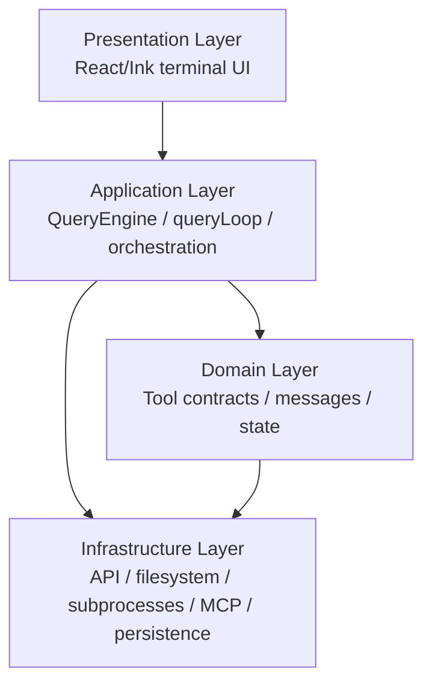
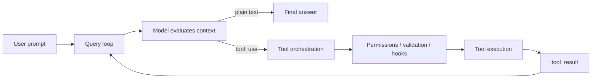
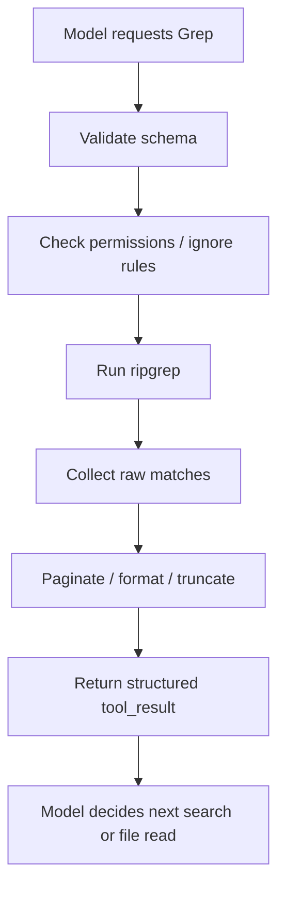
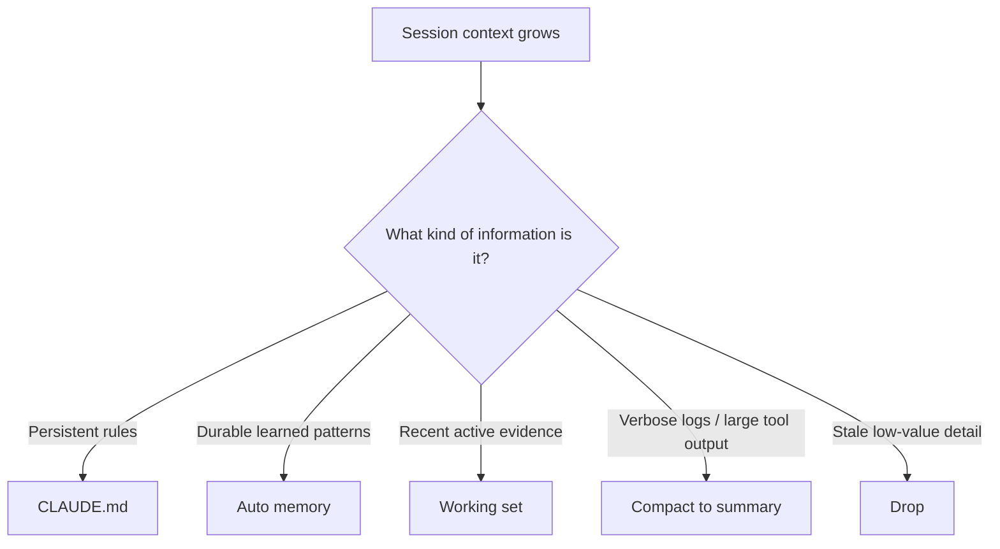

# Inside Claude Code, Reconstructed
## What a production AI coding agent really looks like under the hood

> *A teaching article for computer science students. This article treats Zain Hasan’s reverse-engineered walkthrough of Claude Code as substantially correct, while also using Anthropic’s public Claude Code documentation to anchor the product behaviors that Anthropic has officially documented. Low-level internal implementation details should therefore be read as informed reconstruction, not as official Anthropic design notes.*

For a long time, students were taught to think about AI coding tools as chat interfaces with autocomplete. You ask a question, the model suggests a patch, and the interaction ends there. That mental model is now too small. Systems like Claude Code are not merely “chatbots that know programming.” They are agent runtimes: software systems that let a model inspect a repository, search through code, read and write files, run terminal commands, manage permissions, compact memory, and sometimes delegate work to other agents.

That shift matters because it changes what you need to understand. If you think the product is “just the model,” then you will over-focus on prompting. If you realize the product is a **model wrapped in a runtime**, then the most important questions become architectural. What are the control loops? How are actions represented? Where do permissions live? How is context kept coherent over long sessions? How do multiple agents coordinate without stepping on each other?

Zain Hasan’s architectural teardown of Claude Code is valuable because it lets us study those questions directly. Anthropic’s public documentation says Claude Code can read code, edit files, run commands, integrate with tools, maintain persistent project memory, use subagents, and even orchestrate teams of sessions. Hasan’s reconstruction tries to map the internal machinery that makes those behaviors possible. When you read the two together, a very clear picture emerges: a production AI coding agent is not mainly a prompt. It is a layered software system.

This article is written for students. For every major subsystem, we will ask three questions:

**What is it?**  
**Why is it designed that way?**  
**How does it likely work at the code level?**

By the end, the “magic” should feel much less mysterious and much more like serious systems engineering.

---

## 1. The conceptual leap: from chatbot to agent runtime

A normal chatbot follows a shallow loop: user input goes in, generated text comes out, and the process stops. That works for explanation, brainstorming, and drafting, but it does not work well for software engineering. Real software work is iterative. You read the error log, inspect the file, search the codebase, run the tests again, compare the outputs, revise your hypothesis, then try again. A coding agent must therefore do more than answer. It must **act**, observe the consequences of those actions, and use the new evidence to decide what to do next.

Anthropic’s public docs describe Claude Code in exactly those terms. The system gathers context, takes action using tools, gets new information back from those tools, and uses that information to determine the next step. Hasan’s reconstruction makes this more concrete by identifying a central `queryLoop()` implementation that appears to coordinate this repeated cycle of reasoning and acting.

So the first deep idea is this:

> Claude Code is not best understood as “Claude in a terminal.”  
> It is better understood as a small operating system for model-driven software work.

The model supplies reasoning. The runtime supplies everything else: tool access, UI, permissions, memory management, persistence, orchestration, and safety boundaries.

If you miss that point, almost every later design choice will seem arbitrary. Once you see it, the whole architecture starts to make sense.

---

### The working flow is as follows: 

You type a message.

The app first parses your input and turns it into one or more internal user messages. Then it builds the conversation
context: current messages, system prompt, date/project context, and tool permissions.

Next it sends a request to the model with streaming enabled. As tokens and blocks arrive, the app immediately emits assistant
output to the UI.

If the model emits tool_use blocks, the app pauses normal assistant completion and runs those tools. Tool outputs are
converted into tool_result messages and appended to the conversation.

Then it calls the model again with the updated conversation (including tool results), so the model can continue from those
results. This repeats until there are no more tool calls and no continuation condition is triggered.

During this loop, the app also handles safety/recovery behaviors:

- context compaction when prompt gets too large,
- retries/fallbacks for streaming or token-limit issues,
- stop hooks and permission gates,
- token-budget continuation/stop rules.

When the loop ends, the final assistant response is already in the message history, and the turn is marked complete in UI/
session storage.

---


## 2. The architecture is layered because action needs structure

Hasan’s reconstruction presents Claude Code as a layered system with four broad zones:

1. **Presentation Layer**
2. **Application Layer**
3. **Domain Layer**
4. **Infrastructure Layer**

That is an extremely useful way to teach the system.

### What it is

The **Presentation Layer** is the terminal user interface: the input box, the conversation transcript, status lines, spinners, dialogs, and permission prompts. Hasan maps this to a custom React/Ink terminal UI.

The **Application Layer** is the orchestrator. This is where the query engine lives. It handles the main agent loop, tracks message history, coordinates tool execution, manages session state, and decides what happens next.

The **Domain Layer** contains the core abstractions that make the rest of the program coherent. The most important one is the tool contract: the common interface that every capability must satisfy. Message types and state models also belong here.

The **Infrastructure Layer** is the side-effect layer. It is where the program talks to the Anthropic API, reads and writes the file system, launches subprocesses like `rg` or test runners, persists session history, integrates with MCP, and records analytics or telemetry.

### Why it is designed this way

Because large language models are probabilistic and side effects are dangerous.

If a model is allowed to directly improvise against the file system, the shell, and the UI with no architectural boundaries, the result is fragile and risky. You want the model’s reasoning to be **separated from privilege**. The model can propose an action; the runtime decides whether that action is valid, permitted, well-formed, and safe to execute.

This is a classic software-engineering move. Separation of concerns is not a decorative principle here. It is one of the things that stops an autonomous coding agent from becoming a glorified `eval()`.

### How it likely works

A user prompt enters through the presentation layer. The application layer converts that into a structured message and adds it to the session history. The model then emits either normal assistant text or a structured tool request. That request is validated against a schema from the domain layer and, if accepted, executed by the infrastructure layer. The infrastructure layer returns a structured result, which the application layer feeds back into the model context for the next turn of reasoning.

Here is the overall shape:



This is one of the most important lessons for students: once a model can act, **architecture becomes safety**.

---

## 3. Startup is not boilerplate; it is how the agent wakes up

Most students ignore startup code because it looks mundane. In an agent, startup is part of the intelligence.

### What it is

Hasan’s startup diagram suggests that Claude Code has multiple entrypoints and a staged bootstrap process. There appears to be a fast path for trivial commands like `--version`, and a heavier initialization path for the full interactive agent runtime. Startup loads configuration, determines the working directory, checks authentication, sets up hooks, detects repository state, loads memory, prepares command routing, and finally launches the interactive terminal UI.

### Why it is designed this way

Because an agent cannot reason well if it wakes up blind.

Suppose the model starts speaking before the runtime has figured out:
- which project directory it is in,
- whether Git is initialized,
- what `CLAUDE.md` files apply,
- which tools are enabled,
- which permissions are active,
- and what prior session memory exists.

In that case, the model is reasoning inside the wrong world model. It may suggest commands that do not exist, ignore project-specific rules, or repeat work that has already been done.

Startup also matters for latency. A CLI tool is judged immediately. If `claude --version` takes several seconds because it eagerly loads the full agent runtime, the system feels bloated. Hasan’s reconstruction suggests the designers cared about that and split fast-path startup from the full interactive boot path.

### How it likely works

A lightweight entrypoint checks the invocation mode. If the command is trivial, it returns without loading the full interactive stack. Otherwise, the main orchestrator initializes the session:

1. Determine the current working directory.
2. Discover project context and repo state.
3. Load user and project configuration.
4. Load persistent memory (`CLAUDE.md` plus auto memory).
5. Set up hooks and external integrations.
6. Preconnect to API/auth systems if needed.
7. Construct the application state store.
8. Launch the terminal UI and REPL.

The design idea is simple but powerful: **the model should begin working only after the runtime has already constructed a valid local world**.

---

## 4. The heartbeat of the system is the query loop

If there is one subsystem students should understand deeply, it is this one.

### What it is

Hasan identifies `queryLoop()` as the core interaction engine. Anthropic’s docs describe the same behavior conceptually: Claude gathers context, takes action, sees the results, and continues until the task is complete.

This is the classical ReAct pattern—reason and act—but embedded into a serious production runtime.

### Why it is designed this way

Because software engineering is not one-shot generation. It is iterative error-driven adaptation.

A human developer does not fix a bug by staring into space and producing the correct patch from first principles every time. Instead, the human alternates between *thinking* and *touching the environment*: reading files, running tests, inspecting outputs, narrowing hypotheses, trying a change, and verifying it. A coding agent must be forced into the same cycle if it is going to be useful on real repositories.

### How it likely works

At a high level, the loop is:

1. Receive a user message.
2. Assemble the current context.
3. Send the message history, system prompt, and available tool schemas to the model.
4. Stream partial output back to the UI.
5. If the model emits a tool call, pause ordinary assistant output.
6. Validate and execute the tool.
7. Wrap the result as a structured `tool_result`.
8. Append that result to history.
9. Call the model again.
10. Repeat until no more tool calls are emitted.

A teaching pseudocode version looks like this:

```typescript
async function* queryLoop(history, tools, systemPrompt) {
  while (true) {
    const response = await streamModel({
      history,
      tools,
      systemPrompt
    })

    yield* response.tokens

    if (response.toolUses.length === 0) {
      return response.finalMessage
    }

    const toolResults = await runTools(response.toolUses)
    history.push(response.assistantMessage, ...toolResults)
  }
}
```

That is not Claude Code’s literal source. It is the architectural essence.

The reason Hasan highlights `queryLoop()` as an **async generator** is also worth understanding. A normal function returns once. A promise resolves once. But an agent turn contains many intermediate states: partial text, progress messages, tool interceptions, permission prompts, resumed generation, and final completion. An async generator is a natural fit because it can keep yielding events to the UI while the underlying loop continues to work.

This is a beautiful example of programming model matching product behavior.

Here is the loop in diagram form:



---

## 5. The tool contract is the real center of gravity

Many students assume the central abstraction in an AI agent is “the prompt.” In Claude Code, the deeper abstraction is almost certainly **the tool interface**.

### What it is

Hasan points to a generic tool contract—something like `Tool<Input, Output, Progress>`—that standardizes how capabilities are represented. A tool has:
- a name,
- a description,
- a schema for inputs,
- an execution function,
- permission properties,
- and often some rendering or progress behavior.

Anthropic’s public tools reference supports this interpretation from the outside. Claude Code exposes a large library of named tools: file access, shell execution, search, web tools, skills, subagents, task tools, and team orchestration tools.

### Why it is designed this way

Because once every capability becomes “just a tool,” the rest of the system becomes composable.

The query loop no longer needs a special-case code path for every possible action. It does not need one pathway for file reads, another for shell commands, another for web search, another for skills, and yet another for agent teams. It only needs to know how to:
- validate a tool request,
- permission-check it,
- execute it,
- and feed the result back into the loop.

That is an enormous simplification.

It also means external tools—such as MCP integrations—can plug into the same runtime model. This is what good systems abstractions do: they reduce the number of special cases.

### How it likely works

The model emits a structured request like:

```json
{
  "tool": "Grep",
  "input": {
    "pattern": "auth",
    "path": "src/"
  }
}
```

The application layer does **not** blindly execute that. Instead, it looks up the named tool, validates the input against the tool’s schema, runs permission logic, invokes lifecycle hooks, executes the tool, captures its output, and wraps the output as a structured result message.

In other words, the model suggests; the runtime decides.

This is also where deterministic programming protects the system from model hallucination. Hasan emphasizes heavy schema validation, and that matters. If the model invents a nonexistent parameter or formats input incorrectly, the tool layer can reject the request and force the model to self-correct instead of crashing the application.

That is a major design principle for any serious AI agent:

> Never let the model define the runtime.  
> Let the runtime define the action vocabulary, and require the model to conform.

---

## 6. Data models tame the chaos

The more agentic a system becomes, the more dangerous raw strings become.

### What it is

Hasan’s walkthrough points to strongly structured message and tool data models: `UserMessage`, `AssistantMessage`, `ToolCall`, `ToolResult`, app-state stores, and tool schemas validated with Zod. The system appears to rely heavily on typed data rather than unstructured string passing.

### Why it is designed this way

Because LLMs are good at plausible text and bad at strict contracts unless forced into them.

If the agent loop allowed raw natural-language strings to flow directly into shell commands, file writes, or internal state transitions, subtle errors would accumulate quickly. One malformed tool request, one invented parameter, or one broken assumption about output shape could derail the whole session.

Structured data models turn the runtime into a narrow interface that the model must satisfy. That gives the software something to validate.

### How it likely works

When the model requests a tool, the tool input is parsed against a schema. If the parse fails, the runtime generates an error object that can itself be fed back into the model context. The model then gets another chance to issue a corrected tool request.

So instead of crashing, the system can teach the model to repair its own syntax.

This is a recurring theme in modern AI systems: **use the model for flexible reasoning, but wrap it in deterministic validators at every boundary where errors become expensive**.

---

## 7. Deep dive: the Grep tool as a miniature case study

If you want to understand how much engineering goes into a single “simple” tool, Hasan’s analysis of the Grep tool is extremely instructive.

### What it is

The Grep tool gives the agent a surgical code-search capability. Instead of reading giant files blindly, the model can search for patterns across a repository and then inspect only the relevant pieces.

### Why it is designed this way

Because search is one of the most important cognitive primitives in software engineering.

A naïve agent that reads whole files linearly will waste context, money, and time. Real codebases are too large. A smart coding agent must be able to search *selectively* and then decide what to inspect in detail.

### How it likely works

Hasan’s reconstruction suggests that the Grep tool is a first-class tool rather than a loose shell alias. That means it probably has:
- a Zod schema,
- typed parameters,
- path controls,
- pagination,
- result shaping,
- permission filtering,
- and a dedicated execution layer.

He also traces it to a ripgrep-backed implementation, which makes engineering sense. `rg` is fast, optimized, and available across developer environments. The runtime likely shells out to `rg`, captures the results, applies formatting and truncation, and returns a structured result object.

The pagination behavior is especially important. If a query returns thousands of matches, the system cannot stuff all of them into the model context. So the tool returns only an initial slice, along with enough metadata for the model to request the next page if needed.

That is a wonderful pattern for students to notice. Instead of asking the model to digest the whole world at once, the environment itself becomes **incrementally queryable**.

A conceptual flow looks like this:



This is what a production AI interface looks like: not “just let the model run grep,” but “package grep as a strongly typed, permission-aware, context-efficient search primitive.”

---

## 8. Permissions are layered because side effects are dangerous

This is the point where AI architecture turns into systems safety.

### What it is

Hasan’s permission flow suggests that tool execution passes through multiple layers of control:
- static settings,
- tool-level permission logic,
- mode-based policy,
- and possibly explicit user approval.

Anthropic’s public docs confirm that Claude Code has multiple permission modes and that permissions vary by tool and execution context.

### Why it is designed this way

Because there are two bad extremes:
- ask the user before everything, which makes the agent unusable,
- or ask before nothing, which makes it reckless.

A layered permission system lets the runtime apply cheap deterministic rules first and reserve human interruption for genuinely sensitive actions. That is a standard systems tradeoff: reduce friction without giving up control.

### How it likely works

A tool request arrives. The runtime first checks whether the tool is categorically allowed or denied under the current configuration. Then it applies tool-specific rules. For example, a read-only search may be low risk, while a shell command that mutates the repository may require stronger checks. If the decision remains unresolved, the system asks the user.

Hooks probably fit into this pipeline too. Anthropic’s public docs describe hooks as lifecycle-triggered user-defined scripts or prompts. That means hooks can enforce policy outside the model loop: block writes to protected files, trigger formatting after edits, or inject extra information at certain boundaries.

This is an important conceptual separation:

> The model reasons about what to do.  
> Hooks and permission layers enforce what is allowed.

That is exactly how a serious agent runtime should be built.

---

## 9. Memory management is one of the hardest problems in the whole system

Many people think the hard part of an AI coding agent is generating code. In practice, one of the hardest parts is helping the system stay coherent over a long session.

### What it is

Anthropic’s public docs describe several persistent-memory mechanisms:
- `CLAUDE.md` for user- or project-authored rules,
- auto memory for learned workflow details,
- and session context that grows during interaction.

Hasan’s reconstruction goes much deeper and identifies a layered compaction system involving tool-result budgets, snip compaction, microcompaction, context collapse, and autocompact strategies.

### Why it is designed this way

Because long-running agent sessions create context entropy.

Over time, the model sees:
- shell output,
- file contents,
- diffs,
- failed hypotheses,
- successful hypotheses,
- repeated search results,
- prior instructions,
- and user corrections.

If you keep everything forever, the context window fills up, latency rises, cost rises, and the model starts losing clarity. If you summarize too aggressively, the model loses causal continuity and starts forgetting why it was doing something in the first place.

So the runtime must solve a hard optimization problem:
- preserve what matters,
- delete what is cheap to forget,
- summarize what can be compressed,
- and do so without damaging the task.

### How it likely works

At a simple level, the system probably distinguishes among:
- **stable guidance**: rules from `CLAUDE.md`,
- **durable learnings**: auto memory,
- **active working set**: recent messages and files,
- **compressible logs**: verbose tool outputs,
- **discardable noise**: stale details that are no longer useful.

Hasan’s reconstruction suggests that large command outputs can be reduced to tiny summaries once they are no longer needed. A command like `npm install` may initially produce hundreds of lines of output, but later in the session the system only needs a compact record such as “install succeeded.”

That is not just a convenience. It is what keeps the agent usable over time.

Here is a conceptual memory hierarchy:



Students should notice how much this resembles systems ideas they already know:
- cache management,
- log compaction,
- garbage collection,
- summarization,
- and layered storage.

Again, the “AI” part is only one piece. The rest is runtime engineering.

---

## 10. Skills, subagents, and teams: one assistant becomes a platform

A crucial mistake beginners make is treating all extensions as the same thing. Claude Code’s ecosystem is more structured than that.

### What it is

Anthropic publicly distinguishes:
- **Skills**: reusable workflows or task-specific procedural knowledge.
- **Subagents**: specialized assistants with their own context and tool restrictions.
- **Agent teams**: multiple Claude Code sessions coordinating as peers.

Hasan’s reconstruction complements this with lower-level details about communication patterns and orchestration.

### Why it is designed this way

Because one monolithic context is often the wrong unit of work.

If the main agent is trying to search the repository, plan a change, implement a patch, and verify the result all in one continuous context, the session can become cluttered and self-reinforcing. Separation can improve both efficiency and epistemic quality.

For example:
- a read-only exploration agent can inspect code without polluting the main context with every intermediate search,
- a planning agent can gather context without performing writes,
- an evaluation agent can test or review a change independently rather than inheriting all the implementation assumptions.

This is especially important because LLMs are prone to self-confirmation. The same model that wrote a patch may be too eager to believe the patch is correct. Architectural separation is one way to reduce that failure mode.

### How it likely works

A **skill** likely acts like a packaged operational recipe. It tells Claude how to handle a recurring class of tasks.

A **subagent** likely launches with:
- its own context window,
- a specialized system prompt,
- tool restrictions,
- and its own local working memory,
then returns a distilled result to the parent session.

An **agent team** goes further: multiple sessions can work in parallel, coordinate tasks, and communicate with one another.

This is one of the strongest signals that Claude Code is not a chatbot with extra features. It is an **agent platform**.

---

## 11. The UI is not decoration; it is the control surface of the runtime

Students sometimes underestimate terminal UI architecture because they associate “frontend” with browsers. Hasan’s walkthrough shows why that is a mistake.

### What it is

The terminal UI appears to be built on a custom React/Ink stack with components for messages, prompt input, status lines, spinners, and permission dialogs.

### Why it is designed this way

Because a coding agent is highly asynchronous and stateful.

The user needs to see:
- streaming assistant output,
- tool progress,
- interactive permission prompts,
- status information,
- and multi-step execution unfolding in real time.

A plain blocking terminal program would make that experience clumsy and opaque. A component-based UI makes the system more understandable and controllable.

### How it likely works

The query loop yields events. The UI subscribes to those events and updates the screen incrementally. Permission requests appear as dialogs. Status widgets update token or cost information. Tool execution can surface spinners or progress lines. The message list updates as partial text arrives.

So even though the surface is “just a terminal,” the architectural lesson is the same as in browser software: once your interface becomes dynamic and asynchronous, **state management matters**.

---

## 12. The deepest takeaway

When students first encounter systems like Claude Code, they often focus on the model and ask, “How smart is it?” That is not the wrong question, but it is not the deepest one.

The deeper question is:

> What software architecture allows a smart but fallible model to interact with the real world safely and effectively?

Claude Code is an excellent case study because the answer is visible in its structure:
- a layered architecture,
- a central reason-act-observe loop,
- a uniform tool abstraction,
- typed data models and schema validation,
- search primitives like Grep,
- layered permissions and hooks,
- context compaction and memory hierarchies,
- and delegated execution through skills, subagents, and teams.

Put differently:

> An autonomous coding agent is not mainly a model feature.  
> It is a systems-engineering achievement built around a model.

That is the real lesson. The cloud model provides cognitive horsepower. But the reason the product is usable is everything around it: contracts, boundaries, compaction, orchestration, and control.

For students who want to build the next generation of AI systems, this should be encouraging. You do not need to invent a frontier model to do important work. You can build enormous value by understanding the deterministic scaffolding that lets these probabilistic systems behave like disciplined software workers.

---

## Appendix: How to build a mini-Claude-Code for teaching

If you want to teach these ideas in a classroom, the best approach is not to reproduce the full product. The best approach is to build a **minimal educational agent runtime** that demonstrates the core architectural ideas in a form students can actually understand.

The goal is not feature completeness. The goal is conceptual clarity.

### Step 1: keep the architecture small but faithful

Build four modules:

- `ui/` — a tiny CLI or terminal chat loop
- `app/` — the query loop and session coordinator
- `domain/` — message types and a generic tool interface
- `infra/` — file I/O, subprocess execution, and model API adapter

Even in a teaching prototype, resist the urge to let everything call everything else directly. The architectural lesson is part of what you are teaching.

A simple layout might look like this:

```text
mini-claude-code/
├── ui/
│   └── repl.ts
├── app/
│   └── queryLoop.ts
├── domain/
│   ├── messages.ts
│   └── tool.ts
├── infra/
│   ├── fsTools.ts
│   ├── shellTools.ts
│   └── modelClient.ts
├── memory/
│   └── compact.ts
└── main.ts
```

### Step 2: define a tiny tool contract

Do not start with dozens of tools. Start with three:

- `ReadFile`
- `WriteFile`
- `RunCommand`

Define a generic interface like:

```typescript
export interface Tool<I, O> {
  name: string
  description: string
  validate(input: unknown): I
  canRun(input: I): Promise<boolean>
  run(input: I): Promise<O>
}
```

This teaches the most important architectural idea: **actions are contracts, not raw strings**.

### Step 3: implement the query loop

Your minimal loop only needs to:
1. accept user input,
2. call the model,
3. detect tool calls,
4. validate and execute them,
5. append results to history,
6. repeat until the model emits plain text.

Even if you hard-code the tool-call format for teaching, students will immediately see the shift from “chatbot” to “agent.”

### Step 4: add one safety boundary

Before every write or shell command, ask the user for confirmation. Keep read-only actions approval-free. This instantly illustrates the difference between low-risk and high-risk capabilities.

Then, in a second iteration, replace the global approval with a tiny permission policy layer:
- allow read tools always,
- ask before writes,
- deny shell commands outside the project directory.

That small change is enough to show why permission systems need structure.

### Step 5: add one search primitive

Implement a `Grep`-like tool, even if it is crude. Students will quickly discover that without search, the agent wastes context reading files blindly. That insight lands much harder when they feel it in code than when they merely hear it in lecture.

### Step 6: add one compaction rule

Store the conversation history in memory. Then create a rule that says:

- if a command output exceeds N lines,
- replace it after one turn with a one-line summary.

Students will immediately see why this matters. The first time the agent reads a long log, context balloons. The compaction pass then demonstrates how a runtime can preserve semantic value while shrinking token footprint.

### Step 7: add one subagent

Create a read-only “explore” subagent that can search and read files, then return a summary to the main agent. Even if this subagent is implemented by calling the same model with a different system prompt and restricted tools, the conceptual lesson is huge:

- isolation reduces context pollution,
- specialization improves clarity,
- and delegation changes the architecture from single-agent to multi-agent.

### Step 8: teach the limitations honestly

A mini-Claude-Code for teaching will still fail often. That is good. Those failures are instructive.

Students will see:
- malformed tool calls,
- over-eager shell suggestions,
- context loss,
- repetitive loops,
- and self-confirming reasoning.

Those are not reasons the prototype failed to teach the lesson. They **are** the lesson. They show why production agent systems need exactly the kinds of architecture we have been discussing.

### A minimal end-to-end teaching loop

Here is the core concept in stripped-down pseudocode:

```typescript
while (true) {
  const modelOutput = await callModel(history, tools)

  if (modelOutput.type === "assistant_text") {
    render(modelOutput.text)
    break
  }

  if (modelOutput.type === "tool_call") {
    const tool = registry.get(modelOutput.toolName)
    const input = tool.validate(modelOutput.input)

    if (!(await tool.canRun(input))) {
      history.push({
        role: "tool",
        content: "Permission denied"
      })
      continue
    }

    const result = await tool.run(input)
    history.push({
      role: "tool",
      content: JSON.stringify(result)
    })
  }
}
```

This little loop already contains the skeleton of a real agent runtime.

### What students should learn from building it

If your students finish such a prototype and say, “Now I see that the hard part is not just the model,” then the exercise succeeded.

The true educational goal is not to clone Claude Code. It is to teach the architectural mindset behind systems like it:

- separate cognition from privilege,
- represent actions as typed tools,
- make loops explicit,
- control memory growth,
- enforce permissions,
- and use isolation when one context is no longer enough.

That mindset will transfer far beyond Claude Code. It applies to nearly every serious AI agent system being built today.

---

## References and further reading

- Zain Hasan, *Inside Claude Code: An Architecture Deep Dive*  
  https://zainhas.github.io/blog/2026/inside-claude-code-architecture/

- Anthropic, *Claude Code overview*  
  https://code.claude.com/docs/en/overview

- Anthropic, *How Claude Code works*  
  https://code.claude.com/docs/en/how-claude-code-works

- Anthropic, *Tools reference*  
  https://code.claude.com/docs/en/tools-reference

- Anthropic, *How Claude remembers your project*  
  https://code.claude.com/docs/en/memory

- Anthropic, *Hooks reference*  
  https://code.claude.com/docs/en/hooks

- Anthropic, *Create custom subagents*  
  https://code.claude.com/docs/en/sub-agents

- Anthropic, *Orchestrate teams of Claude Code sessions*  
  https://code.claude.com/docs/en/agent-teams

- Anthropic, *How the agent loop works*  
  https://platform.claude.com/docs/en/agent-sdk/agent-loop

- Anthropic, *The Complete Guide to Building Skill for Claude*  
  https://resources.anthropic.com/hubfs/The-Complete-Guide-to-Building-Skill-for-Claude.pdf

- The Verge, *Claude Code leak exposes a Tamagotchi-style ‘pet’ and an always-on agent*  
  https://www.theverge.com/ai-artificial-intelligence/904776/anthropic-claude-source-code-leak
