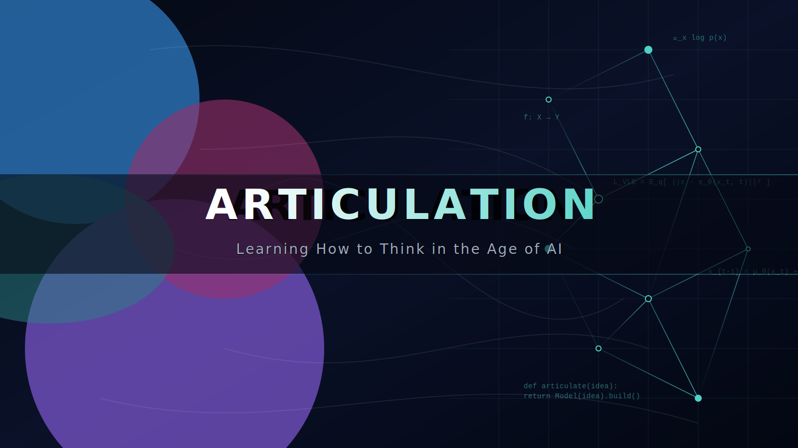

# Articulation 
### Why Knowing Isn’t Understanding

We are living through a quiet but profound shift in what it means to learn.

For most of modern history, learning was constrained by access. If you wanted to understand something like operating systems, compilers, robotics, or GPU architecture, you had to invest years—reading, experimenting, failing, and slowly assembling a mental model piece by piece. Knowledge was scarce, and the act of learning was inseparable from the effort required to obtain it.

That constraint has now largely dissolved.

With large language models, you can ask almost any question and receive a coherent, often high-quality answer within seconds. Entire domains that once required years to enter can now be explored in hours or days. In that sense, knowledge has become abundant—almost frictionless.

And yet, something unexpected has happened.

Despite this abundance, making real progress—especially on problems that do not already have answers—has not become proportionally easier.

What is missing is not knowledge.

What is missing is the ability to think clearly when there is no answer to retrieve.

At the center of that ability is a process we rarely name, rarely teach, and rarely make explicit:

**articulation.**

---

## From “I Understand” to “I Can Build It”

There is a familiar moment in teaching.

A student listens to an explanation and says, “I understand.”

At first glance, this sounds like success. But if you pause and ask a slightly different question, the picture begins to shift.

Can you write this idea as a mathematical formulation?  
What exactly would you implement in code?  
What assumption is this method relying on?

Very often, the confidence fades.

What seemed clear becomes uncertain. The explanation that felt intuitive resists translation into something concrete.

What the student had was not yet understanding in the full sense. It was something more fragile—a kind of recognition. They could follow the idea when it was presented, and even repeat parts of it, but the structure underneath remained implicit.

This gap—the gap between recognizing an idea and being able to construct it—is precisely where articulation lives.

Articulation is the process that turns:

> “I see how this works”

into

> “I know exactly what this depends on, how to formalize it, and how to make it real.”

---

## What Articulation Really Means

It is easy to mistake articulation for clarity of expression. To think that to articulate an idea is simply to explain it more cleanly, or to add more detail.

But that is not what is happening.

Articulation is not about producing more words. It is not about sounding precise. It is not about polishing explanations.

Articulation is:

> **the transformation of an intuition into a structured, constrained, and executable form.**

When an idea first appears, it is usually vague. It may be grounded in examples, visual intuition, or analogy. It feels meaningful, but its boundaries are unclear. It can stretch to fit multiple interpretations.

Articulation begins when you start to resist that flexibility.

You begin to ask: What exactly is being assumed here? What are the variables? What are the constraints? Under what conditions does this idea hold—and under what conditions does it fail?

As these questions are answered, the idea changes in character. It becomes less forgiving, but more real. It loses its ability to mean many things, but gains the ability to do something specific.

> **You give up vagueness in exchange for structure.**

This is not a loss. It is the moment when thinking becomes operational.

---

## An Example from Computer Vision: From Images to Diffusion Models

To see this process clearly, it helps to follow a concrete example.

We begin with a simple observation:

Images in the real world are not random. They have structure.

This statement feels obvious. It also feels almost useless. It does not tell us what kind of structure exists, how to describe it, or how to build a system that captures it. At this stage, we are still describing a phenomenon.

So we take a step further.

Images are observations of a physical world.

This is already an act of articulation. We are no longer merely describing images—we are assigning them a cause. We are saying that images are generated by an underlying process, one governed by physical constraints.

But this is still not enough.

What aspects of the physical world matter? What regularities should a model capture? What properties are essential, and which are incidental?

So we continue to refine.

We begin to notice patterns. Objects tend to occupy contiguous regions. Surfaces are generally smooth, except at boundaries. Lighting changes gradually across space. Transformations such as translation or rotation do not alter identity.

Now we are closer to something meaningful. But we are still speaking in descriptive language. We have identified structure, but we have not yet made it actionable.

This is where articulation deepens.

Take the idea that images are “smooth.” What does that actually mean? It cannot remain a metaphor. It must become a constraint.

One way to express this is to say that neighboring pixels should not change too abruptly. This idea can be translated into a mathematical penalty on large differences between adjacent pixels—what is known as *total variation regularization*. In more intuitive terms, it acts as a guardrail: it discourages unnatural, noisy fluctuations while still allowing sharp edges where they genuinely exist.

Similarly, the idea that valid images occupy a structured subset of all possible pixel configurations leads to the notion of a low-dimensional manifold. Not every arrangement of pixels corresponds to a plausible image; only a small, structured region of the space does.

At this point, something important happens.

The idea is no longer just something we can talk about.

It is something we can compute.

We can write it down. We can optimize it. We can test it. And, crucially, we can break it.

> The idea becomes falsifiable.

This is the threshold where articulation crosses from intuition into science.

Once we have a mathematical structure, the next step is almost inevitable. We must construct a process that operates within this structure. In the case of diffusion models, this takes the form of a gradual transformation: starting from noise and iteratively moving toward the manifold of valid images. The model learns to reverse noise step by step, effectively learning the geometry of the data.

What often appears, from the outside, as a clever algorithm is revealed to be something deeper.

It is not just that diffusion works.

It is that, given a particular set of articulated assumptions about structure, noise, and reconstruction, a diffusion-like process becomes a natural consequence.

The original idea—“images have structure”—has now been transformed into a full chain: assumptions, formalization, and computation.

That transformation is articulation.

---

## Why Articulation Must Be Iterative

It is tempting to imagine this process as linear. Start with an idea, refine it, and eventually arrive at a correct formulation.

But in practice, articulation rarely unfolds in a straight line.

More often, it proceeds in cycles.

You articulate an idea, implement it, and observe its behavior. Something does not work as expected. The failure is not random—it points back to an assumption you made earlier, one that was incomplete or incorrect.

For example, you might begin by treating images as static observations. But then you find that incorporating temporal information—video, motion, dynamics—leads to significantly better models. This forces a revision: the original articulation of the problem was missing an essential component of the physical world.

So you go back.

You revise the assumptions. You reformulate the model. You implement again.

This loop—articulate, implement, observe failure, refine—is not a detour from the process.

It is the process.

Each iteration removes ambiguity. Each failure reveals hidden structure. Each refinement brings the model closer to the reality it is trying to capture.

---

## Articulation and Prompting: The Hidden Connection

There is a subtle irony in the way we use AI systems today.

It is often assumed that these systems reduce the need for thinking. That they allow us to bypass complexity and move directly to answers.

But in practice, the opposite is true.

If you give an AI a vague prompt—something like “build me an app” or “improve this model”—the result is almost always generic, shallow, and unsatisfying. The system has too much freedom. It fills in the gaps arbitrarily.

But when you begin to articulate—when you specify constraints, edge cases, assumptions, and objectives—the behavior of the system changes dramatically.

The AI is no longer guessing what you want.

It is executing a well-defined structure.

At that point, it becomes a multiplier of your thinking, not a replacement for it.

In this sense, what is often called “prompt engineering” is not a new discipline.

At its core, it is simply articulation applied to human–AI interaction.

---

## A Simple Test for Yourself

There is a simple way to tell whether an idea has been fully articulated.

Ask yourself: can this idea be implemented and tested?

If the answer is uncertain, then something remains implicit.

Often, the issue is not that the idea is wrong, but that it is incomplete. The variables may not be clearly defined. The constraints may not be fully specified. The objective may still be ambiguous.

Until these elements are made explicit, the idea does not yet exist in a form that can be reasoned about or built.

---

## Closing Thought

Articulation is not a single step, and it is not something you complete once and for all.

It is a continuous process of sharpening thought—of making ideas more precise, more explicit, and more grounded in structure.

In the past, this process was often hidden behind years of experience. Today, it can—and must—be made explicit.

Because in a world where knowledge is abundant, the real advantage belongs not to those who know more, but to those who can turn knowledge into something usable.

And that transformation begins with articulation.
