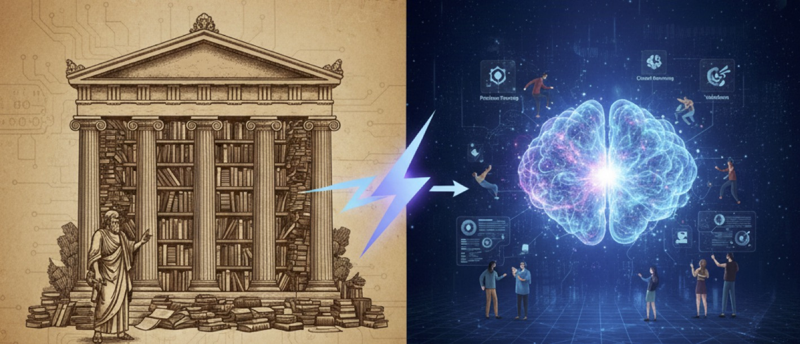

# From Apprenticeship to Algorithms  
### What Education Becomes When Knowledge Is No Longer Scarce

There was a time when education was not a system. It was a relationship.

In the era of apprenticeship, knowledge lived inside people. A craftsman carried his skill in his hands and in his body. A cook, a blacksmith, a carpenter — their expertise was not written in textbooks or searchable in libraries. It was tacit, embodied, and inseparable from practice. To learn meant to enter the workshop. To sweep the floor. To watch. To imitate. To repeat.

Education was slow because knowledge was scarce. And knowledge was scarce because it could not be copied cheaply. A master guarded technique not out of cruelty, but because skill was livelihood. Teaching was not the transfer of information; it was controlled exposure to a way of doing things that could not be reduced to words.

Then came the industrial age.

Machines scaled production, and scale required coordination. Coordination required shared standards. Shared standards required codified knowledge. Modern schools emerged not by philosophical accident but by economic necessity. Classrooms mirrored factories. Students were grouped by age. Subjects were separated. Curricula were standardized. The goal was not to cultivate mystery but to produce reliability.

Knowledge became something that could be written, printed, distributed, and examined. Education became a system of transmission. Teachers were valued for clarity. Students were evaluated for retention. Society needed engineers, accountants, administrators — individuals who could operate within increasingly complex structures.

For centuries, this model worked remarkably well. The bottleneck was access. Books were limited. Libraries were finite. Expertise required proximity. Universities functioned as knowledge reservoirs, and education meant drawing from them.

The digital age loosened that constraint.

Information became abundant. Search engines dissolved the walls of libraries. Lectures could be streamed globally. The scarcity of knowledge began to erode. Yet education largely remained structured around transmission. Students were still tested on recall. Courses still emphasized coverage. The system optimized for delivery even as delivery ceased to be expensive.

And now, with the emergence of large language models, something deeper is changing.

For the first time in history, not only information but fragments of reasoning can be externalized. A model can summarize, draft, explain, generate code, propose solutions, and simulate dialogue. Retrieval cost approaches zero. Encoding cost approaches zero. The effort required to produce coherent text collapses.

If knowledge was once scarce, it is now ambient.

When the cost structure of cognition changes, institutions built around previous constraints begin to drift out of alignment. Education was designed to solve the problem of limited access to structured knowledge. That is no longer the dominant constraint.

The new constraint is different.

When answers are cheap, good questions become expensive. When generation is automated, judgment becomes central. When synthesis is easy, verification becomes difficult. The bottleneck moves from accumulation to orientation.

In earlier eras, education focused on storing knowledge in minds. In this era, education must focus on organizing exploration.

Exploration is not wandering. It is disciplined uncertainty. It is the ability to frame a problem clearly, isolate variables, test assumptions, and refine models of the world. It is the capacity to navigate ambiguity without collapsing into superficial certainty. It requires patience, rigor, and the tolerance of failure.

Large models can assist exploration. They can expand the search space, suggest alternatives, simulate possibilities. But they cannot yet determine which questions are worth asking. They cannot bear responsibility for what is true. They cannot decide which direction matters.

Civilizations grow when they extract rules from the world, accumulate them across generations, and expand them into new domains. Education has always been the mechanism of accumulation. If that mechanism degrades into passive dependence on automated generation, the long arc of progress slows. If, instead, education adapts — training individuals not merely to consume answers but to construct and validate new structures — then artificial intelligence becomes an amplifier rather than a replacement.

The university of the future cannot simply be a warehouse of content. Content is everywhere. Its role must evolve toward becoming an organized environment for structured inquiry. Not a place where information is dispensed, but a place where uncertainty is engaged seriously.

This does not mean abandoning knowledge. Foundations remain essential. But foundations are no longer the endpoint. They are the launch platform.

The apprentice once learned by sweeping the floor of the workshop. The industrial student learned by mastering standardized curricula. The learner of the algorithmic age must learn to navigate a world in which knowledge is abundant but orientation is rare.

The central question is no longer “How do we transmit what we know?” It is “How do we prepare individuals to explore what we do not yet understand?”

Education is entering a new phase not because technology is fashionable, but because the economic structure of cognition has shifted. When memory can be outsourced and text can be generated instantly, the human task moves upward — toward framing, judging, choosing, and imagining.

If we fail to recognize this shift, education becomes an echo of a previous era. If we recognize it, education becomes the guardian of human agency in an age of machine amplification.

The workshop has changed. The factory has changed. The library has changed.

Now education must change.
