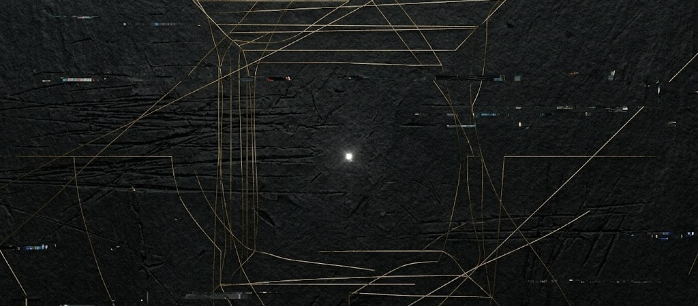

# The Architecture of the Unknown 
### Philosophy, Wisdom, and the Human Edge

Philosophy is the name we give to the act of reaching into the dark. It is the sentinel that stands at the boundary where our language begins to fray and our certainties fail.

We often mistake philosophy for a dusty archive of settled arguments, but its true nature is far more volatile. It is what happens when we are haunted by questions we do not yet have the dignity to ask correctly. It is the "unease" before the "answer." Long before a scientist measures a phenomenon or a coder maps a logic, the philosopher feels the draft of an open door. They circle the incomprehensible, making tentative gestures toward a truth that remains, for the moment, just beyond the light.

This is the central paradox of the mind: human understanding rarely debuts with clarity. It begins with a shadow—a nagging intuition that the world is deeper than our current descriptions allow. Philosophy is the art of staying in that shadow until our eyes adjust.

## The Great Exile

If you trace the lineage of human thought, you see a recurring pattern of exile. Philosophy is the mother of all sciences, and like a mother, she is defined by what she lets go.

In the courtyards of Athens, "Natural Philosophy" was an unruly, beautiful mess. It contained the seeds of everything. But as soon as a question becomes clear enough to be measured, it is evicted from the realm of philosophy and given a new name. When we learned to count the stars, it became Astronomy. When we learned to weigh the soul, it became Psychology. When we mastered the pulse of matter, it became Physics.

Philosophy is not a static field; it is a retreating frontier. It lives exclusively in the territory where understanding has not yet caught up with wonder. It is the pioneer that builds the cabin, only to move further into the wilderness once the town arrives.

## Wisdom: The Only True Currency of Freedom

We live in an age obsessed with information, but information is merely the debris of past discoveries. Wisdom is something else entirely. Wisdom is the capacity to navigate the "not-yet-known."

If knowledge is the map of the conquered lands, wisdom is the courage to stand at the edge of the paper where it says Here Be Dragons and keep walking. This is the root of human freedom. A mind that only knows facts is a prisoner of the past; it can only repeat what has already been proven. But a mind that possesses wisdom is truly autonomous. It can look at a void and see a structure. It can look at a crisis and see a question.

To be free is to refuse to be a mere processor of existing data. It is the ability to generate meaning where none was provided.

## The Silicon Mirror: AI as the Ultimate Catalyst

We are currently witnessing the most significant shift of this frontier in human history. Artificial Intelligence is not just a tool; it is a mirror that forces us to look at our own reflection until we look away in discomfort.

For centuries, we defined our "humanity" by our ability to calculate, to categorize, and to synthesize information. We were the "Thinking Animal." But now, we have built machines that can out-think us in every measurable metric. They can find patterns in a billion data points that would take a human lifetime to scan. They can simulate, predict, and optimize with a cold, terrifying elegance.

This is not a threat to our essence; it is a liberation of it.

By automating the "known"—by handling the heavy lifting of information processing—AI is performing the ultimate service for humanity: it is clearing the brush. It is taking over the tasks of the "clerk" so that we can return to being "creators." It democratizes the tools of deep inquiry, allowing any curious soul to stand on the shoulders of all human knowledge.

When the machine provides the What, the human is finally free to focus on the Why. This is the great intellectual equalizer. It moves the frontier of philosophy from the ivory towers into the hands of anyone with the courage to ask.

## The Return of the Amateur

If philosophy is the "love of wisdom," then it is a universal human hunger, not a professional credential. Some of history’s most piercing insights didn’t come from "philosophers" by trade, but from sailors, lens-grinders, and rebels—people whose lives forced them to confront the limits of the world.

In the age of AI, we are all invited back to this table. The machine can give us the "correct" answers to the questions of yesterday, but it cannot feel the unease that leads to the questions of tomorrow. It cannot choose a value. It cannot prefer beauty over efficiency. It cannot brave the unknown, because it only exists within the parameters of the known.

Only we can do that.

## The North Star

Whenever humanity bruises itself against the limits of the known, philosophy appears—not as a map, but as a North Star. It offers no destination and promises no landing; it simply indicates which way is Out.

From the blood-stained stone altars of our ancestors to the shimmering neural networks of the present, the impulse remains unchanged: a stubborn, beautiful refusal to accept what we are told is "the truth" in favor of the truth that has not yet been named.

Wisdom is the only real currency of freedom. It grants us the audacity to choose our own heading in a world increasingly predigested by algorithms. We are not just travelers; we are the architects of the horizon.

