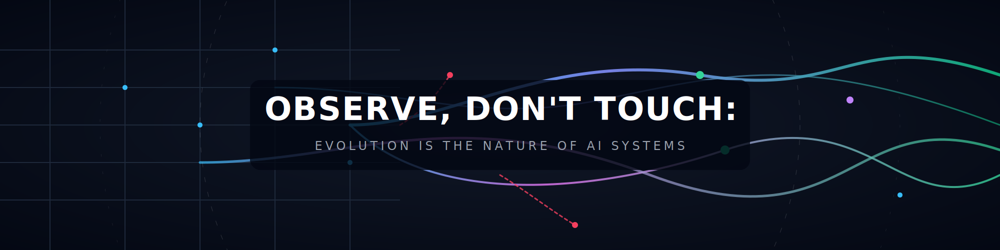

# Observe, Don't Touch:
## Evolution Is the Nature of AI Systems

---

## The Fundamental Mistake in Designing Intelligence

There is a deeper mistake in how we think about building intelligent systems, and it is not merely technical—it is philosophical. We assume that intelligence must be engineered, that correctness must be designed upfront, and that the role of the human is to guide, supervise, and refine every step along the way. These assumptions feel reasonable because they reflect how we build traditional software, but they fundamentally misunderstand how intelligence emerges. Intelligence is not constructed through control; it is discovered through evolution.

If we look at nature—not metaphorically, but mechanistically—we see a consistent pattern. Complex, adaptive systems are not designed to be correct at the beginning. They are placed within a set of constraints, allowed to act, allowed to fail, and allowed to iterate. Over time, structure emerges, behavior stabilizes, and intelligence takes form. The defining property of such systems is not correctness, but the capacity for self-evolution.

This is the principle we should adopt for AI.

Instead of building systems that are correct, we should build systems that can become correct. Instead of enforcing intelligence, we should create the conditions under which intelligence can emerge. Instead of continuously intervening, we should define the laws of the system and then allow it to evolve within them. In this sense, the role of the human changes fundamentally. We are no longer operators or controllers; we are observers of a process that unfolds on its own.

Observe, but do not touch.

This is not passivity. It is discipline. It is the recognition that intelligence cannot be forced into existence—it must be allowed to develop.

---

## Human as God: The Discipline of Non-Intervention

In this framework, the role of the human changes completely. The human is no longer an operator who drives the system step by step, nor a supervisor who continuously corrects its reasoning. Instead, the human becomes something closer to a creator of conditions—a “god-like” observer who defines the boundary of the system, establishes the laws under which it operates, and then steps back to observe its evolution.

The principle here is simple but extremely difficult to follow in practice: we observe, but we do not touch. This is not because intervention is impossible, but because intervention destroys the very property we are trying to create. The moment the human decides what experiment to run, what conclusion is correct, or how knowledge should be structured, the system stops being autonomous and instead becomes an extension of human cognition.

To build a system that can truly learn and evolve, we must allow it to act, to make decisions, to fail, and to recover on its own. The human’s role is to watch, understand, and occasionally adjust the boundaries—but never to micromanage the internal process.

---

## Why Intelligence Cannot Begin with Correctness

A second misconception that must be discarded is the belief that correctness is the starting point of intelligence. In reality, correctness is the endpoint of a long and iterative process. A child does not learn by being correct, a scientist does not discover by being correct, and a biological organism does not evolve by being correct. In all of these cases, progress emerges through repeated cycles of attempt, failure, observation, and refinement.

Mistakes are not incidental to learning—they are the mechanism through which learning occurs. If a system is prevented from making mistakes, it is also prevented from discovering which assumptions are wrong, which abstractions are insufficient, and which representations need to be revised. Therefore, the goal is not to eliminate errors, but to preserve them as signals.

At the same time, mistakes must not be destructive. They must be observable, traceable, and recoverable. The system must never lose its history, lose its evidence, or overwrite its past silently, because without memory, mistakes cannot become knowledge. Learning requires not only failure, but the ability to reason about failure.

---

## From Engineered System to Living Organism

Once these principles are accepted, the system can no longer be understood as a conventional piece of software. It is not a pipeline, nor a collection of modules, nor a fixed architecture. Instead, it becomes something closer to an organism—an entity that interacts with its environment, generates hypotheses, performs experiments, receives feedback, and adapts its internal structure over time.

In the specific case of GPU architecture, the system explores performance behaviors, constructs causal explanations, and refines its understanding through experimentation. But more importantly, it is not only learning about GPUs; it is learning how to study GPUs. It is learning how to design better experiments, how to represent knowledge more effectively, and how to interpret signals more accurately.

This dual process—learning about the world and learning about its own learning process—is what allows the system to become more robust, more general, and more autonomous over time.

---

## Dynamic by Default: Stability as an Emergent Property

If the system is truly learning, then its structure cannot be fixed. The questions it asks, the experiments it designs, the schemas it uses, and the abstractions it constructs must all be allowed to evolve. There is no predefined ontology that can capture all future knowledge, and no static representation that will remain sufficient as the system explores new regimes.

However, this does not imply instability or chaos. It implies something more subtle: stability is not imposed, but discovered. Structures that prove useful will persist because the system continues to reuse them, while those that fail will naturally be discarded. Over time, patterns stabilize—not because we enforce them, but because the system finds them consistently valuable.

In this sense, static structure is not the starting point of the system; it is the result of its evolution. Static is relative, while dynamic is absolute.

---

## The Minimal Laws That Make Learning Possible

Even in a fully dynamic system, there must exist a minimal set of invariants. These are not design choices, but necessary conditions for learning itself. The system must have a loop that allows it to iterate, a memory that allows it to accumulate knowledge, a notion of provenance that links claims to evidence, and reproducibility that ensures observations can be verified.

These elements form the minimal “laws of the universe” in which the system operates. Without them, learning collapses into noise. With them, the system can evolve freely while remaining coherent. Everything beyond these minimal constraints—representation, abstraction, interface, and even parts of execution—should remain flexible.

---

## The Human Bottleneck: Cognitive Bandwidth

At this point, a critical constraint emerges. Humans have limited cognitive bandwidth. The system may run continuously, generating experiments, evolving schemas, and accumulating knowledge at a scale that far exceeds what a human can directly follow. If we expose all internal details, the system becomes unintelligible; if we hide too much, it becomes untrustworthy.

This tension cannot be resolved by static dashboards or manually designed interfaces. Instead, the system must generate its own interface—an adaptive communication channel that bridges the gap between high-speed internal learning and low-bandwidth human understanding.

---

## Two Interfaces: Process and Knowledge

To achieve this, the system must provide two fundamentally different views of itself. The first is the process view, which answers the question: what is happening right now? This view compresses the system’s current state into a concise summary, including the current question, the latest experiment, the observed results, the generated claim, the next step, and any issues that may require attention. Its purpose is situational awareness.

The second is the knowledge view, which answers a deeper question: what has the system learned that is worth understanding? This view abstracts away individual experiments and focuses instead on concepts, mechanisms, and relationships. It explains what patterns have been discovered, why they hold, what evidence supports them, and where uncertainty remains.

These two interfaces must remain distinct. One is temporal and process-driven, while the other is structural and knowledge-driven. Together, they allow the human to both monitor the system and learn from it.

---

## Interface as Cognitive Compression

The purpose of the interface is not to display information, but to compress cognition. Internally, the system may operate with enormous complexity, but externally it must present only what matters: what changed, why it changed, and how reliable that change is. The interface must transform execution traces, evolving schemas, and numerous artifacts into clear causal updates that a human can quickly understand.

Importantly, the interface itself should evolve. It should learn how to better communicate, how to better compress information, and how to better align with human cognition. Just like the rest of the system, it should not be fixed, but continuously refined.

---

## Learning the World and Learning Itself

At a deeper level, the system is engaged in two intertwined learning processes. It is learning about the external world—GPU architecture, performance regimes, and causal mechanisms—but it is also learning about itself. It is learning how to structure knowledge, how to design experiments, how to interpret evidence, and how to improve its own internal tools.

This dual learning process allows the system to continuously refine not only what it knows, but how it knows. Over time, this leads to increasing robustness, generalization, and autonomy, because the system is no longer bound to a fixed methodology—it is evolving its own.

---

## The Final Principle: Let It Become

We can now state the design philosophy in its simplest and most precise form. We are not building a system that is correct by construction; we are building a system that becomes correct through evolution. We are not building a system that avoids mistakes; we are building a system that uses mistakes as signals. We are not building a system that we control; we are building a system that we observe.

The process is simple: create the system, define its laws, allow it to act, allow it to fail, allow it to learn, and observe. Because in the end, the goal is not to construct something that works once, but to create something that continues to improve—even when we are no longer guiding it.

That is the difference between a tool and an organism. And that is the kind of system worth building.
